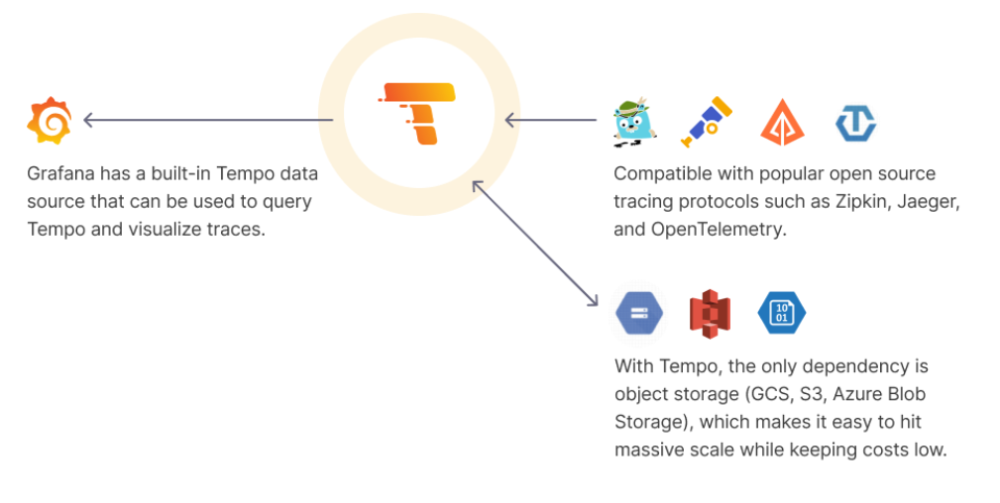

# Prometheus - Tempo

[Back](../../index.md)

- [Prometheus - Tempo](#prometheus---tempo)
  - [Tracing and Distributed Systems](#tracing-and-distributed-systems)
    - [Terminologies](#terminologies)
  - [Grafana Tempo](#grafana-tempo)
    - [Architecture](#architecture)
  - [!Install - Ubuntu](#install---ubuntu)

---

## Tracing and Distributed Systems

- `Tracing`
  - the tracking and monitoring the **flow of requests** as they propagate through various services within a distributed system.
  - help understand
    - which services the request interacted with.
    - how long each step took
    - any errors encountered along the way.
- Benefit:

  - identify bottelnecks and performance issues
  - debug distributed systems
  - understand dependencies
  - monitor service health

- Common Tracing system
  - Instrumentation
    - Zipkin
    - OpenTelemetry
    - NewRelic
  - Capture, store, analyse, and visualize
    - Zipkin
    - NewRelic
    - Jaeger
    - Grafana Tempo

---

### Terminologies

- `trace`

  - represent the overall flow or a request as it traverses through multiple services.
  - consist of one or more `spans`.
  - has `trace id`

- `Span`:

  - a single unit of work within a `Trace`.
  - information about specific action or operation. ie. execute a database query.
  - has a `Spen ID`

- `Trace Context`

  - metadata of each trace. ie., trace id and spen id

- `sampling`
  - which request to trace?
  - reduce the volume of captured trace data.

---

## Grafana Tempo

- `Grafana Tempo`
  - an open-source and high-scale distributed tracing backend.
  - used by `Grafana` as a **data source to visualize** `Trace` data.
  - suppots a query language called `TraceQL`
  - not need a database,but support:
    - local storage(disk)
    - AWS S3
    - GCP
    - AZure Blob



---

### Architecture

- Microservices send traces using `OTLP`
- Alloy forward traces
- Tempo collects traces
- TraceQL querys traces

---

## !Install - Ubuntu

- ref:
  - https://grafana.com/docs/tempo/latest/setup/linux/

```sh
# download
curl -Lo tempo_2.2.0_linux_amd64.deb https://github.com/grafana/tempo/releases/download/v2.2.0/tempo_2.2.0_linux_amd64.deb
echo e81cb4ae47e1d8069efaad400df15547e809b849cbb18932e23ac3082995535b \
  tempo_2.2.0_linux_amd64.deb | sha256sum -c

# install
sudo dpkg -i tempo_2.2.0_linux_amd64.deb

# start service
sudo systemctl enable --now tempo
```