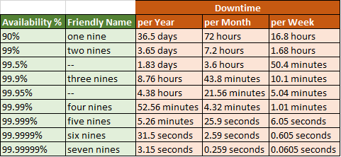

# SRE Fundamental

[Back](../../index.md)

## SRE vs DevOps

- SRE
  - focus on reliability, availability, and performance
  - goal:
    - balance between reliability and developement velocity
  - roles & responsibilities
  - Measrement
- DevOps
  - focus communication, collaboration, and integration throughuot software development cycles
  - goal:
    - release fast

- overlap

---

## Tools

monitoring and alerting
incident management tools
automation and configuration: ansible
iac
testing
sucurity and identity management
backup and dr solutions
observability
load balancer and proxies
containers and orchestrations
cloud
applicaion deployment

---

## Operating models

the framework defines how the IT department operates to support the business objective and delivery value to customer and stakeholders.

- Traditional Operations
  - dev builds it and you runs it.
- Decentralized devops
  - you build and run it

---

## Agile and SRE

- **Iterative** and **incremental improvements**
  - bot focus on continuous improvements
- Continuous **monitoring** and feedback
  - agile encourages continous feedback and product monitoring
  - aligns with SRE's emphasis on observability and real-time monitoring
- faster **incident response** and resolution
  - agile practices, dailies, retro, demo
  - enables SRE teams to respond to reliability needs in earlier stages.

---

## Reliability

ability of a system, product, or service to perform its intended function consistently and deendably under a given set of conditions and over a specific period of time

- consistency
  - deliver same results when performing a specific task or operation
- Availability
  - available and accessible to users whenever they need it, without unexpected downtime or outages.
- Durability
  - Withstand extended perfiod of use or operation without degradation of failure
- Fault Tolerance
  - Resilient to faults or failures and can recovery gracefully from errors
- Preditability
  - Users can predict how the system will behave as expeced or not

---

## Trade-off: resiliency vs innovation

- `Total development Time`

Total Development Time in days = sum of story points \* {1 day / number of points per day}

- commonly: more reliability features, less innovation, long time to market
- both reliability and innovation by
  - automation
  - reusable codes
  - modules

---

## SRE Tenets

- Ensuring a Durable Focus on Engineering
  - 50% operational work and 50% engineering work
  - operational work: focus on thread incidents and post-mortems writing
- Pursuing Maximum Change Velocity Without Violating a Service’s SLO
  - outage budge, used to resolve the pace of innovation and product stability
  - 99% SLO: 1% of error budget
  - spend the error budget taking risks with new functionalities.
  - An outage is no longer "bad" thing, but part of the innovation process.
- Monitoring(Alerts, Tickets and logging)
  - system should track system's health
  - alerts: human need to take action immediately
  - tiket: human need to take action, ubt not immediately
  - logging: should be recorded for diagnostic or forensic purpose.
- Emergency Response
  - `mean time to failure(MTTF)`
    - measures the average time between non-repairable failures
  - `mean time to repair(MTTR)`:
    - Total time spent on repairs / Number of repairs.
    - the metric to evaluate the effectiveness of emergency response
  - pre-defined playbooks for on-calls
- Change Management
  - 70% of outage are due to chages in live system
  - best practices:
    - progressive rollouts
    - quickly detecting problems
    - rolling back change safety when problems arise.
- Demand Forecasting and Capacity Planning
  - keep the sufficient capacity and redundancy to server projected future demand with required availability.
  - Organic growth(natural growth) vs inorganic growth(evntes, like feature launch)
  - must to have:
    - accurate organic demand forecast
    - accurate incorporatnio of inorganic demand sources into demand forecast
    - regular load testing of the system to correlate raw capacity
- Provisioning
  - provision new capacity must be conducted quickly and only when necessary, as it is expensive.
  - must be automatically without human intervention
  - Must cover instance spin up, database, network, configuration in the provisioning.
- Efficiency and Performance
  - efficient use of resources
  - avoid unnecessary costs

---

## SRE Principles and practices

- https://sre.google/sre-book/part-II-principles/

- Principle
  - Embracing Risk
  - Service Level Objectives
  - Eliminating Toil
  - Monitoring Distributed Systems
  - Automation
  - Release Engineering
  - Simplicity
- Practices
  - monitoring
  - incident response
  - postmortem and RCA
  - Testing
  - Capacity planning
  - Development
  - Product

---

## SRE Role Responbitilies

- Design and architecture
  - Collaborate with Software development team to design and implement resilient architectures
- Monitoring and alerting
  - Set up monitoring system to track health of services and respond promptly to incidents, diagnosing and mitigating disruptions.
- Automaion
  - Leverage automation and code-driven solutions to streamline operations, reducing manuall toil and enabliing faster and more reliable deployments.
- Release management
  - partiipate in the deployment and release process, ensuring that new changes are rolled out safety and with minimal impact on system relability
- Capacity Planning
  - Perform capacity planning to ensure that systems can handle current and future loads
- Perform optimizations
  - Analyse system performance and identify areas for optimization, working to improve response time, reduce latency, and enhance overall efficiency.
- Backup and disaster recovery
  - develop and test plans to prepare for potential catastrophic events, Create and design solutions to meet RPO/RTO
- Security & Compliance
  - Collaborate with security teams to ensure that systems meet security standards and compliance requirements.

---

## Nines of availability

- Five 9s predicts that a measured IT component will be available at least 99.999% of the time during a specific period.

---

## Principle

- [Embracing Risk](./embracing_risk.md)
- [Service level objectives](./slo.md)
- [Eliminating Toil](./toil.md)
- [Monitoring](./monitoring.md)
- [Automation](./automation.md)
- [Release engineering](./release.md)
- [Simplicity](./simplicity.md)

---

## Pratices

### Incident Response

- on-call
  - 50% in operation activities
- Effective troubleshooting
  - troubleshooting steps
    - problem report
    - triage
    - examine
    - diagnose
    - test/treat
    - cure
  - SRE should be trained
  - monitoring and alert provide alert context
- emergency response
  - clear and assertive escalation process defined
  - effective communication is maintained with stakeholders, keeping them informed about the incident, response efforts, and estimated recovery time.
- monitoring
  - idenfity the kpi, sli, metrics
  - set appropriate threhold
  - avoid alert fatigue
  - can set composite metric
    - e.g.,
      - slo: alert if error > 5% and response time > 500ms
      - business: cart abandonment rate > 50% and Checkout response time > 3s
- use anomaly detection

---

### Postmortem and Root-Cause Analysis

- Postmortem
  - a detailed retrospective report created after an incident or outage has occured.
  - provides an in-depth analysis of what happened, why it happened, and the steps taken to resolve the incident.
  - reduce the likelihood and impact of recurrence.
  - include:
    - user visible downtime or degradation
    - data loss of any kind
    - on-call engineer intervention
    - start and ended time
    - the action plan to minimize/avoid it.

- Root-Cause Analysis(RCA)
  - a systematic approach to identify the underlying reasons or fundamental factors that contributed to a specific incident or problem.

- create actionable recommendations

---

### Testing

- `unit test`
  - smalliest and simplest test
  - assess a separable unit of the software.
- `integration test`:
  - asseble units into large components
- `system test`
  - complete and integrated system
  - types:
    - smoke test
    - performance test
    - regression test
    - end-to-end
- deployment testing
  - run during deployment, validate system reliability before execute a full rolling deploy
- Backup/Recovery and Disaster Recovery
  - backup and recovery impact the Recovery Point Object(RPO) and (Recovery Time Objective)RTO
  - create restore playbooks

### Capacity planning

- Traffic forecasting and capacity projections
  - using historical data and traffic forecast
- auto scaling and dynamic provisions
  - automatically add or remove resources

---

## Tooling

- iac: terraform, CDK, terragrunt, cloudformation
- configuration management tool: ansible, chef, puppet
- Monitoring and alerting: prometheus, grafana, cloudwatch, Datadog
- IT management and documentation: jira, confluence
- cloud: aws, gcp, azure
- cicd: github, gitlab, codebuild, jenkins,