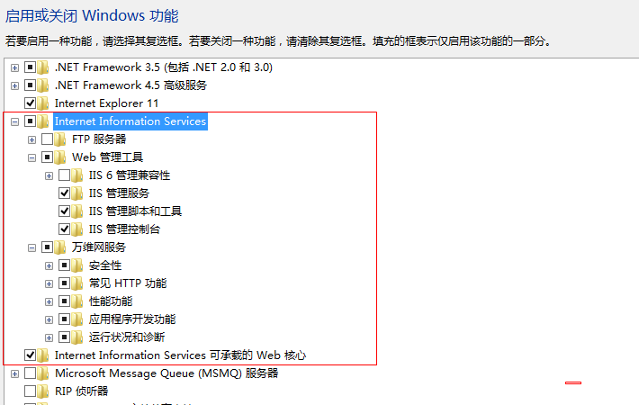
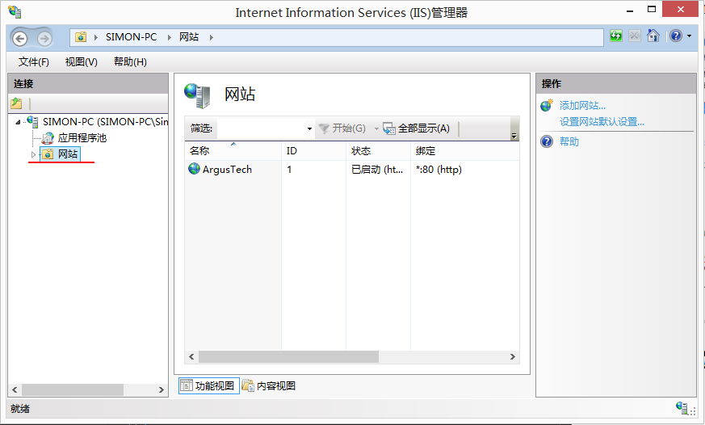
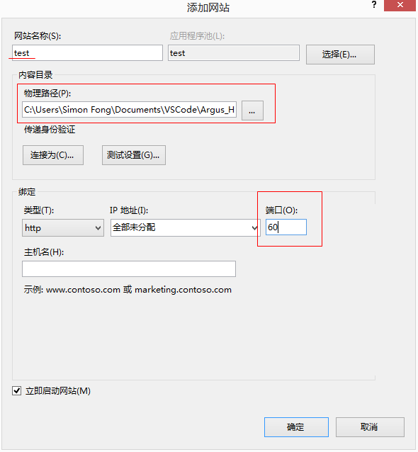
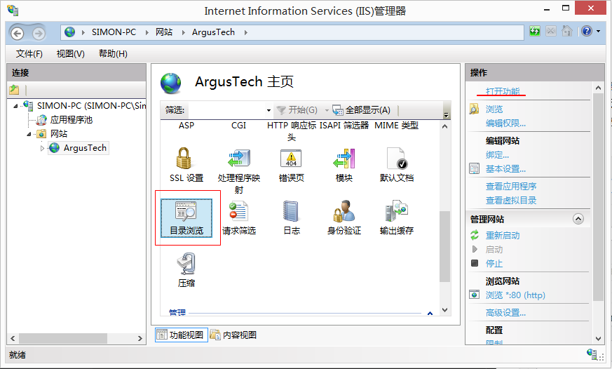
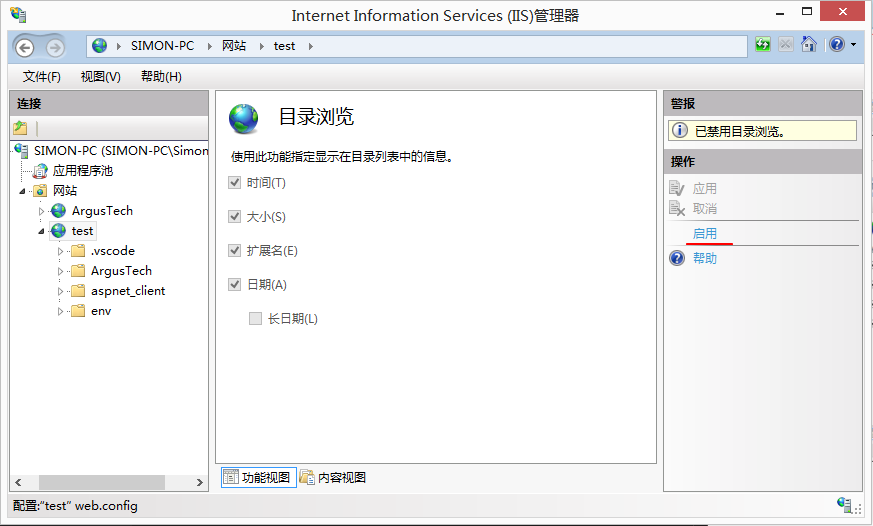
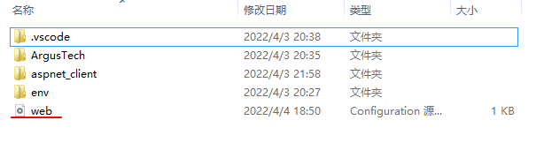
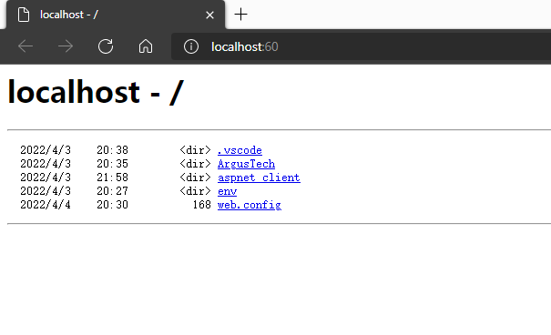
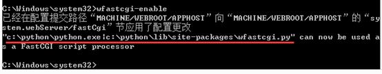
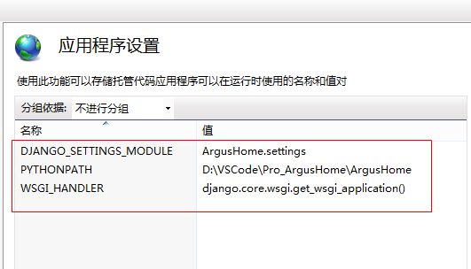
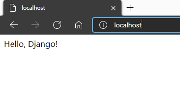

# Django - 部署到IIS

[返回Django首页](../django_index.md)

## 目录

- [Django - 部署到IIS](#django---部署到iis)
  - [目录](#目录)
  - [思路](#思路)
  - [1.使用VCS创建Django站点](#1使用vcs创建django站点)
  - [2.设置IIS](#2设置iis)
    - [2.1 启用IIS功能(Win8)](#21-启用iis功能win8)
    - [2.2 在IIS添加站点](#22-在iis添加站点)
  - [3.安装Python包](#3安装python包)
    - [3.1 安装Python](#31-安装python)
    - [3.2 安装Django包和wfastcgi包](#32-安装django包和wfastcgi包)
  - [4.修改web.config参数](#4修改webconfig参数)

## 思路

- 工具：VS Code

- 1. Django@VCS
- 2. IIS设置
- 3.  安装python包到windows: django, wfastcgi
- 4. 修改web.config设置

## 1.使用VCS创建Django站点

- 1. 创建项目文件夹;

>注意：
>1. 后续步骤需要为IIS指定物理路径，所以需要一早确定项目文件夹;
>2. 项目文件路径中的文件夹名称不能有空格，否则后续指定wfastcgi无法指定；

- 2. 使用VCS创建django站点;
 
 详参：[安装设置\@VS Code](django_setup.md)

 ***

## 2.设置IIS

### 2.1 启用IIS功能(Win8)

- <u>控制面板</u>
- <u>程序和功能</u>
- <u>启用或关闭Windows功能</u>
- 勾选<u>Internet Information Services</u>



***

### 2.2 在IIS添加站点

- 添加网站
  - <u>控制面板</u>
  - <u>管理工具</u>
  - <u>Internet Information Service (IIS) 管理器</u>
  - 右键<u>添加网站</u>



- 设置参数
  - 网站名称：**在IIS显示的网站名称**；
  - 应用程序：使用默认值；
  - 物理路径：**选择项目文件夹**；
  - IP地址：使用默认值；
  - 端口：**指定端口**；
  - 主机名：使用默认值；



- 设置<u>目录浏览</u>
  - 双击<u>网站</u>
  - 点击<u>目录浏览</u>
  - 点击<u>打开功能</u>
  - 勾选<u>启用</u>





>说明：
>当点选启用目录浏览后，会在指定文件夹创建web.conig文件
>当文件在之后的步骤负责设置网站参数。
>

- 验证设置

在浏览器中打开<u>localhost:<端口></u>



>说明：
>端口是60;
>由于开启了<u>目录浏览</u>,所以网站内容是指定项目文件夹的内容。

[回到目录](#目录)

***

## 3.安装Python包

### 3.1 安装Python

略。

>说明：
>安装路径中，最好没有使用包含空格的文件夹名。

***

### 3.2 安装Django包和wfastcgi包

- 安装django包：
  - 以管理员身份运行CMD, 输入命令`pip install django`
  - 验证安装, 命令`pip list`

- 安装并启用wfastcgi包:
  - 以管理员身份运行CMD, 输入命令`pip install wfastcgi`
  - 验证安装, 命令`pip list`
  - 启用wfastcgi包, 输入命令`wfastcgi-enable`并记下返回的参数。



>说明：
>wfastcgi参数在后续的步骤要使用。

[回到目录](#目录)

***

## 4.修改web.config参数

- 修改项目文件夹下的web.config文件

```xml
<?xml version="1.0" encoding="UTF-8"?>
<configuration>
  <system.webServer>
    <handlers>
      <remove name="MyFastCGI" />
      <add name="Python FastCGI" 
        path="*" 
        verb="*" 
        modules="FastCgiModule" 
        scriptProcessor="<wfastcgi_arg>"
        resourceType="Unspecified" 
        requireAccess="Script" />
    </handlers>
  </system.webServer>
  <appSettings>
    <add key="WSGI_HANDLER" value="django.core.wsgi.get_wsgi_application()" />
    <add key="PYTHONPATH" value="<directory>" />
    <add key="DJANGO_SETTINGS_MODULE" value="<app>.settings" />
    </appSettings>
</configuration>
```

>代码说明：
>- 1. 添加handlers：
>   - 先移除原有的MyFastCGI,在添加Python的FastCGI
>   - 设置**scriptProcessor的值**：该值设置Python的wfastcgi库，所以其值是 `python地址|wfastcgi库地址`。如`C:\Python310\python.exe|C:\Python310\lib\site-packages\wfastcgi.py`。
>   - 否则在IIS中的站点会显示错误500
>- 2. 设置appSettings:
>   - 1. **WSGI_HANDLER的值**：要与Django文档中settings.py文件的WSGI_APPLICATION的值一致。
>   - 否则无法正常运行站点。
>   - 2. **PYTHONPATH的值**：设定Django文档所在文件夹路径。此处将设置为IIS站点所在的文件夹路径\<directory\>。
>   - 否则无法正常运行站点。
>   - 3. **DJANGO_SETTINGS_MODULE的值**：指向Django的settings。
>   - 此处设置为\<app\>.settings。否则无法正常运行站点。
>   - 当设置好appSettings后，IIS会通过web.config文件的参数。在IIS中可以看到这些参数的键值。
> 

- 使用浏览器测试。



[回到目录](#目录)

***
