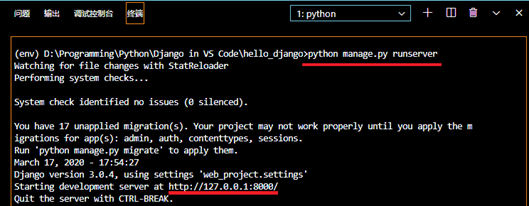
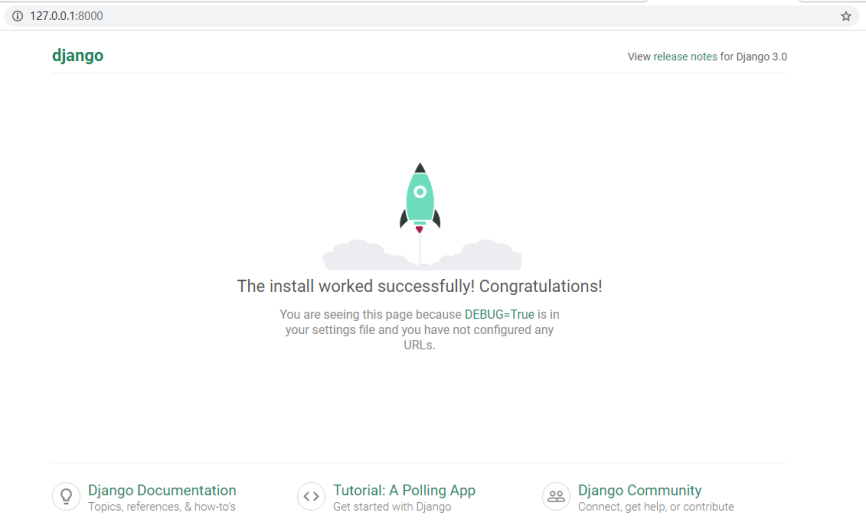
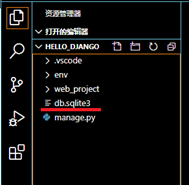
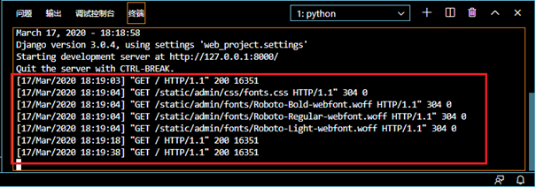

# Django - 安装设置\@VS Code

## 目录

- [Django - 安装设置\@VS Code](#django---安装设置vs-code)
  - [目录](#目录)
  - [通用知识](#通用知识)
  - [1. 配置环境：虚拟环境+Django包](#1-配置环境虚拟环境django包)
  - [2. 创建项目](#2-创建项目)

## 通用知识

- Project与app之间的关系：
  - 一个Project可以包含多个app；
  - 在Project中的每个app实现一个独立功能；
  - 一个app可以在多个Project中；
  - 一个app仅仅是遵循Django约定的**Python包**。

- **django-admin工具**是Django管理命令行工具之一，安装好Django包后可以直接调用。

## 1. 配置环境：虚拟环境+Django包

1.	创建项目文件夹。
2.	创建专用虚拟环境： 
    - CMD命令： `python -m venv <environment_name>`
><environment_name>: 通常是env。由VS Code的设置的`Python: Env File`参数设定：`${workspaceFolder}/env`
3.	选择解析器：
    - VS Code: 
      - 1. <kbd>Ctrl</kbd>+<kbd>Shift</kbd>+<kbd>P</kbd>
      - 2. 选择python解析器
    - CMD命令：
      - 项目文件夹路径：`env\scripts\activate`
4.	安装Django库:
    - CMD命令：`python -m pip install django`

[返回目录](#目录)

***

## 2. 创建项目

1. 创建项目文件夹
   - CMD：`django-admin startproject <project_directory> .`
>代码说明:
>- “.”表示在当前路径中创建项目文件夹。
>- 执行命令后，当前文件夹中会创建Django框架的文件夹和文件：
>   - manage.py：当前项目的Django命令行管理实用程序。
>   - 一个以<project_directory>命名的文件夹，文件夹包括以下文件：
>       - **\_\_init\_\_.py**：一个空的文件，用于标识本文件夹是一个Python模块包（module package）。此时可以在代码中引用该包中的py文件（如a.py存在与web_project文件夹中，则可以使用from web_project import a；否则会报错。）
>       - **asgi.py**：用于处理具有异步功能的标准接口。
>       - **settings.py**：包含Django项目的设置
>       - **urls.py**：包含一个Django内容的表，通常用于**设置路由**。
>       - **wsgi.py**：兼容WSGI的Web服务器为您的项目提供服务的入口点。 通常，此文件保持原样，因为它为生产Web服务器提供了挂钩。

2. 第一次运行Django项目：测试是否创建成功。
   - CMD: `python manage.py runserver`

>网页使用Django发开服务器（Django's development server）运行，默认地址为http://127.0.0.1:8000/，默认端口为8000。

>**注意**：
>1. **默认数据库SQLite**
当首次运行服务器时，将会自动创建默认SQLite数据库db.sqlite3.  

>2. **Django发开服务器（Django's development server）**
只作本地开发调试使用。当部署到web主机时，wsgi.py模快**负责连接到web主机服务器**。
>3. **指定端口**
使用以下命令指定端口：`python manage.py runserver 5000`
>4. **服务器日志（server log）**
在终端中显示：

>5. **停止Django发开服务器**
>   - 关闭浏览器窗口
>   - 在终端中使用组合键：<kbd>Ctrl</kbd>+<kbd>C</kbd>

[返回目录](#目录)

***
