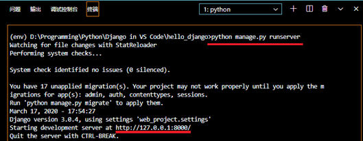
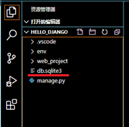
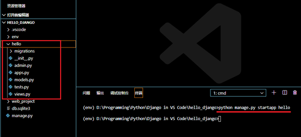
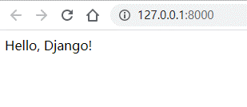
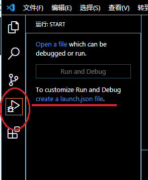
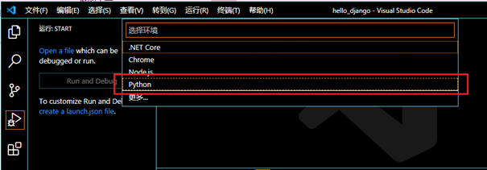
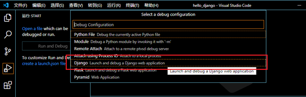
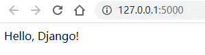

# Django - 安装设置\@VS Code

[返回Django首页](../django_index.md)

## 目录

- [Django - 安装设置\@VS Code](#django---安装设置vs-code)
  - [目录](#目录)
  - [通用知识](#通用知识)
  - [1. 配置环境：虚拟环境+Django包](#1-配置环境虚拟环境django包)
  - [2. 创建项目](#2-创建项目)
  - [3. 创建应用APP](#3-创建应用app)
    - [3.1 创建Django App](#31-创建django-app)
    - [3.2 修改视图views](#32-修改视图views)
    - [3.3 创建app路由文件urls_py](#33-创建app路由文件urls_py)
    - [3.4 修改project路由文件urls_py](#34-修改project路由文件urls_py)
    - [3.5 保存并运行](#35-保存并运行)
  - [4. 创建调试器配置文件](#4-创建调试器配置文件)
    - [4.1 创建调试配置文件launch.json](#41-创建调试配置文件launchjson)
    - [4.2 运行调试](#42-运行调试)


## 通用知识

- Project与app之间的关系：
  - 一个Project可以包含多个app；
  - 在Project中的每个app实现一个独立功能；
  - 一个app可以在多个Project中；
  - 一个app仅仅是遵循Django约定的**Python包**。

- **django-admin工具**是Django管理命令行工具之一，安装好Django包后可以直接调用。


## 1. 配置环境：虚拟环境+Django包

1.	创建项目文件夹。
2.	创建专用虚拟环境： 
    - CMD命令： `python -m venv <environment_name>`
>\<environment_name\>: 通常是env。由VS Code的设置的`Python: Env File`参数设定：`${workspaceFolder}/env`
3.	选择解析器：
    - VS Code: 
      - 1. <kbd>Ctrl</kbd>+<kbd>Shift</kbd>+<kbd>P</kbd>
      - 2. 选择python解析器
    - CMD命令：
      - 项目文件夹路径：`env\scripts\activate`
4.	安装Django库:
    - CMD命令：`python -m pip install django`

[返回目录](#目录)

***

## 2. 创建项目

1. 创建项目文件夹
   - CMD：`django-admin startproject <project_directory> .`
>代码说明:
>- “.”表示在当前路径中创建项目文件夹。
>- 执行命令后，当前文件夹中会创建Django框架的文件夹和文件：
>   - manage.py：当前项目的Django命令行管理实用程序。
>   - 一个以\<project_directory\>命名的文件夹，文件夹包括以下文件：
>       - **\_\_init\_\_.py**：一个空的文件，用于标识本文件夹是一个Python模块包（module package）。此时可以在代码中引用该包中的py文件（如a.py存在与web_project文件夹中，则可以使用from web_project import a；否则会报错。）
>       - **asgi.py**：用于处理具有异步功能的标准接口。
>       - **settings.py**：包含Django项目的设置
>       - **urls.py**：包含一个Django内容的表，通常用于**设置路由**。
>       - **wsgi.py**：兼容WSGI的Web服务器为您的项目提供服务的入口点。 通常，此文件保持原样，因为它为生产Web服务器提供了挂钩。

2. 第一次运行Django项目：测试是否创建成功。
   - CMD: `python manage.py runserver`



>网页使用Django发开服务器（Django's development server）运行，默认地址为http://127.0.0.1:8000/，默认端口为8000。


>**注意**：
>1. **默认数据库SQLite**
当首次运行服务器时，将会自动创建默认SQLite数据库db.sqlite3.  

>2. **Django发开服务器（Django's development server）**
只作本地开发调试使用。当部署到web主机时，wsgi.py模快**负责连接到web主机服务器**。
>3. **指定端口**
使用以下命令指定端口：`python manage.py runserver 5000`
>4. **服务器日志（server log）**
在终端中显示：

>5. **停止Django发开服务器**
>   - 关闭浏览器窗口
>   - 在终端中使用组合键：<kbd>Ctrl</kbd>+<kbd>C</kbd>

[返回目录](#目录)

***

## 3. 创建应用APP

### 3.1 创建Django App
 
  - CMD： `python manage.py startapp <app>`

>说明:
>- 参数\<app\>: 应用APP的名字。
>- 执行命令后将自动创建app文件夹和文件：
>   - migrations 文件夹：存放管理数据库的命令文件
>   - \_\_init\_\_.py：声明当前文件夹是一个python包
>   - admin.py：用于创建admin后台管理界面
>   - apps.py：app应用程序配置文件
>   - models.py：包含定义数据对象的模型类
>   - test.py：app的测试文件
>   - views.py：包含定义网站页面的视图函数
>
> 

***

### 3.2 修改视图views

修改\<app\>\\views.py代码：

```python
from django.http import HttpResponse
# Create your views here.

def home(request):
    return HttpResponse("Hello, Django!")
```

***

### 3.3 创建app路由文件urls_py

在\<app\>\\文件夹中创建urls_py，用于定义路由函数。

```python
from django.urls import path
from <app> import views

urlpatterns = [
    path("", views.home, name="home"),
  ]

```

>- 参数\<app\>:django应用名称

***

### 3.4 修改project路由文件urls_py

修改\<project\>文件夹下的urls_py，让其包含app的路由设置。

```python
from django.contrib import admin
from django.urls import include,path

urlpatterns = [
    path('admin/', admin.site.urls),
    path("", include("<app>.urls")),
]
```
>- 参数\<app\>:django应用名称

***

### 3.5 保存并运行

- 保存所有修改的文件<kbd>Ctrl</kbd>+<kbd>K</kbd> <kbd>S</kbd>
- 运行app：
  - CMD: `python manage.py runserver`
- 打开浏览器登录：http://127.0.0.1:8000/



[返回目录](#目录)

***

## 4. 创建调试器配置文件

在VS Code中可以使用调试器快捷地运行并调试project。

### 4.1 创建调试配置文件launch.json

- 点击创建launch.json文件



- 在命令栏中选择Python环境



- 然后选择Django调试器配置



- VS Code自动创建配置文件launch.json文件：

```python
{
    // 使用 IntelliSense 了解相关属性。 
    // 悬停以查看现有属性的描述。
    // 欲了解更多信息，请访问: https://go.microsoft.com/fwlink/?linkid=830387
    "version": "0.2.0",
    "configurations": [
        {
            "name": "Python: Django",
            "type": "python",
            "request": "launch",
            "program": "${workspaceFolder}\\manage.py",
            "args": [
                "runserver",
                "--noreload",
                "5000"
            ],
            "django": true
        }
    ]
}
```

>代码说明：
>- "${workspaceFolder}/manage.py"：告诉VS Code的Python解析器运行manage.py
>- args：参数列表。
>   - 参数列表中的“runserver，--noreload，5000”，相当于运行命令python manage.py runserver --noreload 5000
>- "django": true：允许VS Code可以调试Django页面模板（templates）

- 保存launch.json文件。

***

### 4.2 运行调试

按下“F5”进行调试。



>**调试器的使用:**
>- 每次进行调试，VS Code将自动保存修改的文件。
>- 记得在每次调试后在终端中按下<kbd>Ctrl</kbd>+<kbd>C</kbd>停止运行app，否则新的调试进程与旧的调试会因为使用相同的端口而报错。

[返回目录](#目录)

***

[返回Django首页](../django_index.md)
