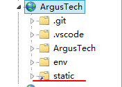

# Django - 静态文件

[返回Django首页](../django_index.md)

## 目录

- [Django - 静态文件](#django---静态文件)
  - [目录](#目录)
  - [总结：](#总结)
  - [1. IDE：创建\/static\/文件夹结构](#1-ide创建static文件夹结构)
  - [2. 添加静态文件夹路径](#2-添加静态文件夹路径)
  - [3. 页面引用静态文件](#3-页面引用静态文件)
  - [4. 部署前：收集所有静态文件](#4-部署前收集所有静态文件)
  - [5. 部署到IIS：设置虚拟目录](#5-部署到iis设置虚拟目录)

***

## 总结：

1. 创建static文件夹结构；
2. 添加static_root参数到setting.py；
3. 页面引用：load static标识符；
4. 部署前：收集静态文件到static_colleted文件夹；
5. 部署到IIS：设置虚拟目录

***

## 1. IDE：创建\/static\/文件夹结构

>说明：
>static文件夹下的文件结构是约定的：
>- \<Django_App\>
>   - \/static\/
>       - web.config
>       - \<Django_App\>
>           - APP的各种静态文件
>

- 1. 在Django App路径下创建文件夹\/static\/,专门用于存放静态文件。

- 2. 在static文件夹创建\/\<Django App\>\/文件夹

- 3. 创建web.config文件。
    在部署时用于设置静态文件参数：

```xml
<?xml version="1.0" encoding="UTF-8"?>
<configuration>
    <system.webServer>
    <!-- 覆盖FastCGI handler,让IIS访问静态文件 -->
      <handlers>
        <clear/>
        <add name="StaticFile"
             path="*"
             verb="*"
             modules="StaticFileModule"
             resourceType="File"
             requireAccess="Read" />
      </handlers>
    </system.webServer>      
</configuration>

```

[回到目录](#目录)

***

## 2. 添加静态文件夹路径

打开django_project路径下的setting.py文件，并添加参数:

```python
STATIC_ROOT = BASE_DIR / 'static_collected'
```

>效果:
>将静态文件夹的路径指定为工作区路径下的\/static_collected\/文件夹。

[回到目录](#目录)

***

## 3. 页面引用静态文件


```django

<link rel="stylesheet" type="text/css" href=""/>
```

>代码说明:
>1. \{\% load static \%\}`:说明以下代码使用`static`标记符,相当于告诉django引用`static_root`参数
>2. `href=""`: 指明href路径是指向`static_root`参数路径下`argusapp/site.css`文件。

[回到目录](#目录)

***

## 4. 部署前：收集所有静态文件

1. 进入Django_project文件夹。 
   - CMD命令：`cd <django_project>`

2. 收集所有静态文件。
   - CMD命令：`python manage.py collectstatic`
   - 执行命令后输入`yes`确认。


>效果：
>1. 在工作区文件夹中创建\/static_collected\/文件夹。
>2. 将static文件夹下所有文件收集到该文件夹下。

[回到目录](#目录)

***

## 5. 部署到IIS：设置虚拟目录

1. 打开IIS
2. 点选网站，右键"添加虚拟目录"


3. 设置参数。
    - 别名：站点显示的虚拟文件目录名称。
    - 物理路径：指定\/static_collected\/文件夹。




[回到目录](#目录)

***

[返回Django首页](../django_index.md)


