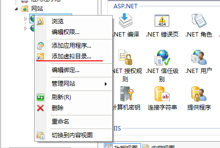

# Django - 静态文件

[返回Django首页](../django_index.md)

## 目录

- [Django - 静态文件](#django---静态文件)
  - [目录](#目录)
  - [总结：](#总结)
  - [开发阶段 Development](#开发阶段-development)
    - [创建存放静态文件的文件夹](#创建存放静态文件的文件夹)
    - [设置settings_py参数](#设置settings_py参数)
      - [参数 INSTALLED_APPS](#参数-installed_apps)
      - [参数 STATIC_URL：存放App专用静态文件的文件夹](#参数-static_url存放app专用静态文件的文件夹)
      - [参数 STATICFILES_DIRS： 存放公共静态文件的文件夹](#参数-staticfiles_dirs-存放公共静态文件的文件夹)
    - [页面引用: static标签](#页面引用-static标签)
    - [简易部署](#简易部署)
  - [部署Production(IIS)](#部署productioniis)
    - [设置settings_py参数：STATIC_ROOT](#设置settings_py参数static_root)
    - [复制静态文件：collectstatic](#复制静态文件collectstatic)
    - [创建web.config文件](#创建webconfig文件)
    - [设置IIS虚拟目录](#设置iis虚拟目录)

***

## 总结：

- 开发阶段development
  - settings.py
    - settings.INSTALLED_APPS
    - settings.STATIC_URL：APP专用
    - (选项)settings.STATICFILES_DIRS:公用
  - html页面：标签load static
  - 简易部署：urls
- 部署Deployment
  - settings.py: STATIC_ROOT
  - 复制文件: collectstatic
  - 访问限制：web.config
  - 虚拟目录

***

## 开发阶段 Development

- 当`settings.DEBUG = True`时，即为开发调试阶段。

- Django处理静态文件有两种模式
  1. APP专用，静态文件根据约定的文件结构仅用于对应的APP;
  2. 公共静态文件，可以跨APP引用。

- Django的路由url搜索顺序是APP专用文件夹，然后是公共文件夹

### 创建存放静态文件的文件夹

### 设置settings_py参数

#### 参数 INSTALLED_APPS

- 确保`INSTALLED_APPS`参数包括`django.contrib.staticfiles`。

```python
INSTALLED_APPS = [
    'django.contrib.admin',
    'django.contrib.auth',
    'django.contrib.contenttypes',
    'django.contrib.sessions',
    'django.contrib.messages',
    'django.contrib.staticfiles',

    '<app>',
]
```

#### 参数 STATIC_URL：存放App专用静态文件的文件夹

- 参数`STATIC_URL`指定APP专用静态文件存放的文件夹。

- 默认值：APP文件夹下的static文件夹。

- 如果缺少该参数，会显示异常`You're using the staticfiles app without having set the required STATIC_URL setting.`

```python
STATIC_URL = 'static/'      #默认值
```

- 约定的文件夹结构

>- \<Django_App\>
>   - \/static\/
>       - \<Django_App\>
>           - APP的各种静态文件
>

***

#### 参数 STATICFILES_DIRS： 存放公共静态文件的文件夹

- 参数`STATICFILES_DIRS`指定公共静态文件存放的文件夹。
- 数类型是数列`[]`。
- 该参数不是必须设置的。

```python
import os

STATICFILES_DIRS = [
    BASE_DIR / "static",
    os.path.join(BASE_DIR, 'collectstatic'),
]
```

***

### 页面引用: static标签

- 在html页面中使用load static标签

```html
  <!-- 由于markdown的影响，static标签无法使用正常标记 -->
  load static
  <link rel="stylesheet" type="text/css" href="static '/Workout/carousel.css' ">

```
>代码说明:
>1. load static:说明以下代码使用`static`标记符,相当于告诉django引用`STATIC_URL`或`STATICFILES_DIRS`参数
>2. `href="static 'argusapp/site.css'" `: 指明href路径是指向`STATIC_URL`或`STATICFILES_DIRS`参数路径下静态文件。

***

### 简易部署

- 在开发调试阶段，可以在APP的urls_py中输入以下代码
  - 效果：使用static()方法，将static_root映射到static_url
  - 不建议在部署时使用该设定。

```python
from django.conf import settings
from django.conf.urls.static import static

urlpatterns += static(settings.STATIC_URL,document_root=settings.STATIC_ROOT)
```

[回到目录](#目录)

***

## 部署Production(IIS)

### 设置settings_py参数：STATIC_ROOT

- 该参数指定部署时所有静态文件储存的地址，其值与上一步的文件夹一致；否则，当执行`collectstatic`时，静态文件会复制到错误的文件夹。
- 一般使用`BASE_DIR / '<dir>/')`,因为base_dir是项目的相对路径；否则将是绝对路径。

```python
STATIC_ROOT = BASE_DIR / 'collect_static/'
```

***

### 复制静态文件：collectstatic

1. 进入Django_project文件夹。 
   - CMD命令：`cd <django_project>`

2. 收集所有静态文件。
   - CMD命令：`python manage.py collectstatic`
   - 执行命令后输入`yes`确认。


>代码说明：
>1. 在`STATIC_ROOT`参数的指定路径创建文件夹；
>2. 将项目当中的`STATIC_URL`或`STATICFILES_DIRS`参数指定的文件夹中的静态文件复制到`STATIC_ROOT`参数指定的文件夹。

[回到目录](#目录)

***

### 创建web.config文件
    
- 在`STATIC_ROOT`参数指定的文件夹创建设置文件：

```xml
<?xml version="1.0" encoding="UTF-8"?>
<configuration>
    <system.webServer>
    <!-- 覆盖FastCGI handler,让IIS访问静态文件 -->
      <handlers>
        <clear/>
        <add name="StaticFile"
             path="*"
             verb="*"
             modules="StaticFileModule"
             resourceType="File"
             requireAccess="Read" />
      </handlers>
    </system.webServer>      
</configuration>
```

>代码说明：
>- 如果没有该代码，当浏览器打开static_root地址时会返回url错误的信息；当存在该代码时，会返回404的服务器代码，即将static_root的访问的路由错误变为服务器的权限错误。

***

### 设置IIS虚拟目录

1. 打开IIS
2. 点选网站，右键"添加虚拟目录"



3. 设置参数。
    - 别名：站点显示的虚拟文件目录名称。
    - 物理路径：指定\/static_collected\/文件夹。


[回到目录](#目录)

***

[返回Django首页](../django_index.md)


