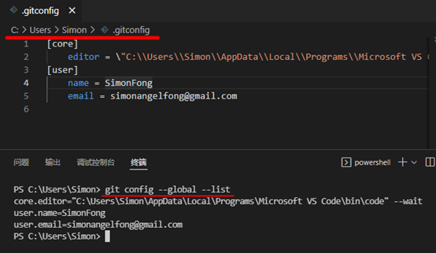

## 设置配置参数-增删查改

#### 目录
  - [查询:所有配置的参数list](#查询所有配置的参数list)
    - [system:查看系统的所有配置](#system查看系统的所有配置)
    - [global:查看用户的所有配置](#global查看用户的所有配置)
    - [local:查看本地的所有配置](#local查看本地的所有配置)
  - [查询:特定key的配置值get section.key或section.key](#查询特定key的配置值get-sectionkey或sectionkey)
  - [添加:特定key的配置值add](#添加特定key的配置值add)
  - [修改：特定key的配置值 section.key value](#修改特定key的配置值-sectionkey-value)
  - [删除：删除特定键值 unset](#删除删除特定键值-unset)
  - [编辑器编辑:edit或-e](#编辑器编辑edit或-e)
  - [回到Git首页](../git_index.md)

***

#### 查询:所有配置的参数list

显示所有配置，包括三层级别的配置

```
git config --list 
```

可以使用参数 -l
```
git config -l 
```


[回到目录](#目录)

***

### system:查看系统的所有配置

```
git config --system –list
```


> 如果返回的信息过长，可以按”q”退出。

[回到目录](#目录)

***

#### global:查看用户的所有配置

``` 
git config --global –list 
```


[回到目录](#目录)

***  
  
### local:查看本地的所有配置

```
git config --local –list
```


[回到目录](#目录)

***

#### 查询:特定key的配置值get section.key或section.key

```
git config --global <section.key> 
```


```
git config --local --get <section.key>  
```


>当没有找到key时，不会返回值：
list后只有app.name，没有app.names。所以不会返回值。


[回到目录](#目录)

***

## 添加:特定key的配置值add

```
git config --global --add <section.key> <value> 
```


```
git config --global <section.key> <value> 
```


[回到目录](#目录)

***

## 修改:特定key的配置值 section.key value

```
git config --local <section.key> <value>
```


[回到目录](#目录)

***

## 删除:删除特定键值 unset 

```
git config --local --unset < section.key >
```


>如果没有section.key，则不会返回值。

[回到目录](#目录)

***

## 编辑器编辑:edit或-e

调用编辑软件打开配置文件
```
git config --local --edit
```


[回到目录](#目录)

***

[返回Git首页](../git_index.md)