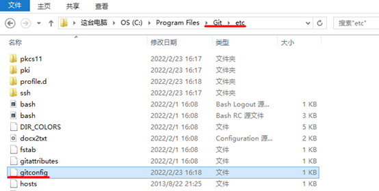
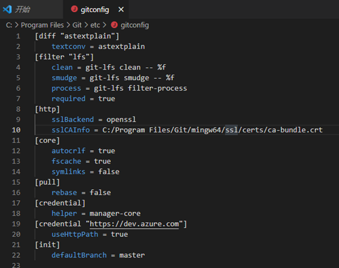
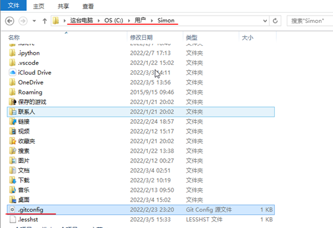

### 配置文件及层级

#### 目录

  - [系统级别system(优先级最低)](#系统级别system优先级最低)
  - [用户级别global(优先级次之)](#用户级别global优先级次之)
  - [仓库级别local(优先级最高)](#仓库级别local优先级最高)
  - [回到Git首页](../git_index.md)

Git 提供了一个叫做 git config 的工具，专门用来配置或读取相应的工作环境变量。
  
这些环境变量，决定了 Git 在各个环节的具体工作方式和行为。这些变量可以存放在以下三个不同级别：

#### 系统级别system(优先级最低)
对所有用户都普遍适用的配置。
文件位置：程序安装路径`\Git\etc\gitconfig`

   

[回到目录](#目录)
***  

#### 用户级别global(优先级次之) 
<mark>只适用于该用户</mark>

文件位置：用户目录/.gitconfig 文件。  

若使用 `git config` 时用 `--global` 选项，读写的就是这个文件。

[回到目录](#目录)
***

#### 仓库级别local(优先级最高)

仅仅针对当前项目有效

文件位置：`工作目录/.git/config`

注意：`/.git/` 通常是隐藏文件夹

若使用 `git config` 时用 `--local` 选项，读写的就是这个文件。

每一个级别的配置都会覆盖上层的相同配置，所以 `.git/config` 里的配置会覆盖 `/etc/gitconfig` 中的同名变量。

[回到目录](#目录)

***

>在 Windows 系统上，Git 会找寻用户主目录下的 `.gitconfig` 文件。主目录即 `$HOME` 变量指定的目录，一般都是 `C:\Documents and Settings\$USER`。  
>
>此外，Git 还会尝试找寻 `/etc/gitconfig` 文件，只不过看当初 Git 装在什么目录，就以此作为根目录来定位。

[回到目录](#目录)

***

[返回Git首页](../git_index.md)
