# Git - 本地仓库操作

[返回Git首页](../git_index.md)

## 目录

- [Git - 本地仓库操作](#git---本地仓库操作)
  - [目录](#目录)
  - [创建：本地git仓库 git init](#创建本地git仓库-git-init)
    - [在当前目录创建git仓库](#在当前目录创建git仓库)
    - [在子目录中创建git仓库](#在子目录中创建git仓库)
    - [通用命令](#通用命令)
  - [克隆：现有的git仓库 git clone](#克隆现有的git仓库-git-clone)
    - [克隆到当前路径](#克隆到当前路径)
    - [克隆到指定路径](#克隆到指定路径)
  - [查看变化：上一次提交后的文件变化git status](#查看变化上一次提交后的文件变化git-status)
    - [无参数：显示所有改动的文件](#无参数显示所有改动的文件)
    - [参数-s：简短输出结果](#参数-s简短输出结果)
  - [查看历史 git log](#查看历史-git-log)
    - [无参数：显示详细历史](#无参数显示详细历史)
    - [参数oneline：显示简洁历史](#参数oneline显示简洁历史)
    - [参数graph：以拓扑图显示历史。](#参数graph以拓扑图显示历史)
    - [参数author：指定用户的历史](#参数author指定用户的历史)
  - [提交：将缓存区中的文件提交到仓库git commit](#提交将缓存区中的文件提交到仓库git-commit)
    - [无参数：无参数时，VSC会打开一个文件并在其中编辑](#无参数无参数时vsc会打开一个文件并在其中编辑)
    - [参数-m \<message>：提交并输入message信息。](#参数-m-message提交并输入message信息)
    - [参数-a：提交缓存区最新修改。](#参数-a提交缓存区最新修改)
  - [恢复版本：将仓库和缓存区退回到指定HEAD，不保留修心修改git reset](#恢复版本将仓库和缓存区退回到指定head不保留修心修改git-reset)
    - [参数1\<head>：退回指定HEAD](#参数1head退回指定head)
    - [参数1 无参数：不会起作用。](#参数1-无参数不会起作用)
    - [参数2 mixed：保留修改在工作区(默认)。](#参数2-mixed保留修改在工作区默认)
    - [参数2 soft：保留修改在缓存区](#参数2-soft保留修改在缓存区)
    - [参数2 hard：不保留修改。工作区与缓存区都被恢复到指定版本。](#参数2-hard不保留修改工作区与缓存区都被恢复到指定版本)
    - [总结：reset](#总结reset)


***

## 创建：本地git仓库 git init

Git 使用 `git init` 命令来初始化一个Git仓库.

在执行完成 `git init` 命令后，Git仓库会生成一个 `.git` 目录，该目录包含了资源的所有元数据。

### 在当前目录创建git仓库

命令
```git
git init
```

会在当前文件夹中创建 `.git` 隐藏文件夹。


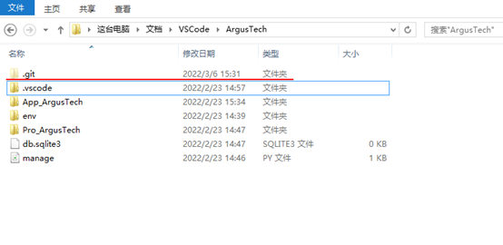

- 重复输入 `git init` 时会重新初始化本地仓库

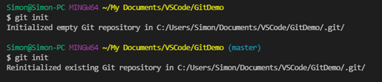

[回到目录](#目录)

***

### 在子目录中创建git仓库

命令

```git
git init <subfolder>
```

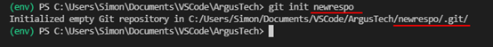

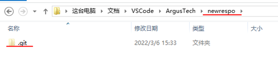

[回到目录](#目录)

***

### 通用命令

```git
mkdir <new folder>
cd <new folder>
git init
```

- mkdir：创建子目录
- cd：进入子目录
- git init：创建git仓库

[回到目录](#目录)

***

## 克隆：现有的git仓库 git clone

### 克隆到当前路径

命令

```git
git clone <remote_repo_url>
```

- <remote_repo_url>: 目标项目的路径。通常是Github项目地址。

- 效果：
  1. 在当前路径创建以github仓库命名的**文件夹**；
  2. 在文件夹中创建 **`.git`隐藏文件夹**用作本地git仓库；
  3. **克隆**所有远端仓库的文件；
  4. 创建**分支master**；

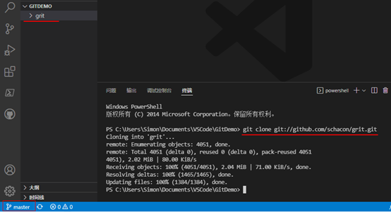

git clone 时，可以所用不同的协议，包括 ssh, git, https 等，其中最常用的是 ssh，因为速度较快，还可以配置公钥免输入密码。

各种写法如下：
- git clone git@github.com:fsliurujie/test.git         --SSH协议
- git clone git://github.com/fsliurujie/test.git          --GIT协议
- git clone https://github.com/fsliurujie/test.git      --HTTPS协议

[回到目录](#目录)

***

### 克隆到指定路径

命令

```git
git clone <remote_repo_url> <directory>
```


- remote_repo_url: 目标git仓库路径。通常是Github项目地址。

- directory：目标文件夹名/路径

- **参数<directory>是文件夹名**：会在当前路径中**创建指定文件夹名的子文件夹**，并克隆远程仓库。

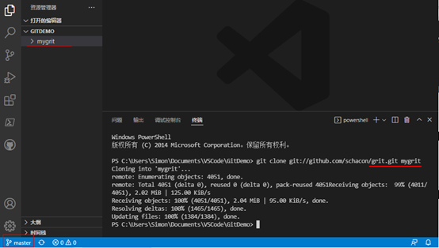

- **参数<directory>是路径**：会在指定路径文件夹中克隆远程仓库。

>代码说明：在父目录中创建mygrit文件夹

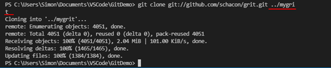

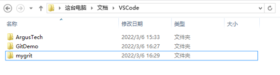

[回到目录](#目录)

***

## 查看变化：上一次提交后的文件变化git status

显示所有文件变化，包括**工作区**与**缓存区**的对比，**缓存区**与**本地仓库**的对比.

命令

```git
git status
```

- 自上一次提交后没有改变时，返回**nothing to commit**

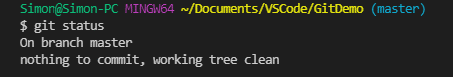

[回到目录](#目录)

***

### 无参数：显示所有改动的文件

- changes to be committed：在缓存区中被改动的文件，包含新增的文件

- changes not staged for commit：已经在缓存区但在工作区中被改动的文件

- untracked files：在工作区中没有提交

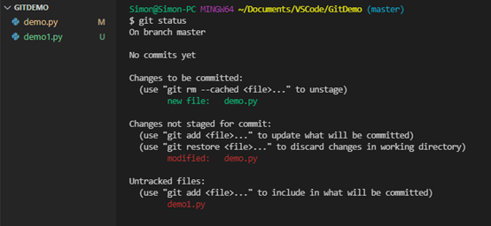

[回到目录](#目录)

***

### 参数-s：简短输出结果

- ??: 在工作区但没有缓存
- A：已经缓存，无提交
- M：已缓存但工作区中文件被修改
- D: 已缓存但工作区中文件被删除

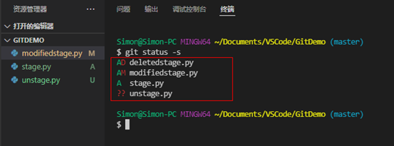

[回到目录](#目录)

***

## 查看历史 git log

命令

```git
git log
```

### 无参数：显示详细历史

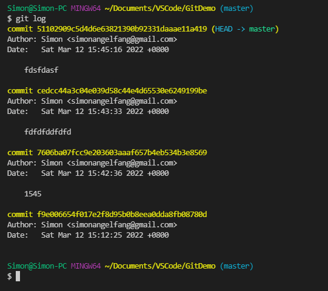

***

### 参数oneline：显示简洁历史

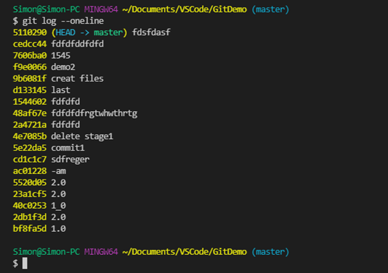

- 可以与--reverse共用。

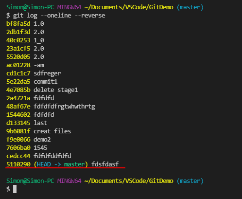

***

### 参数graph：以拓扑图显示历史。

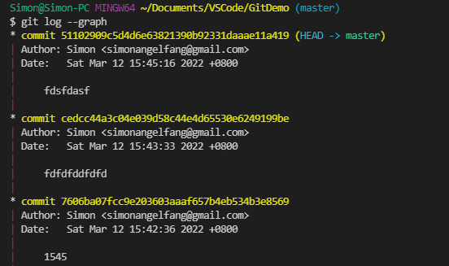

- 可以与--oneline共用。

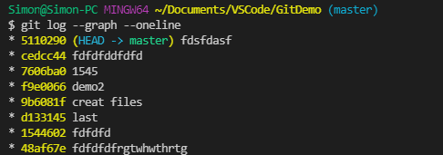

***

### 参数author：指定用户的历史

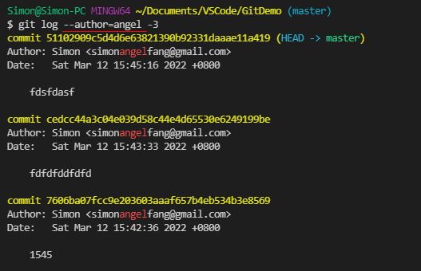

[回到目录](#目录)

***

## 提交：将缓存区中的文件提交到仓库git commit

命令

```git
git commit 
```

- 如果自上一次提交后没有修改，则会返回**nothing to commit**.

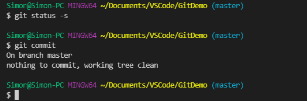

***

### 无参数：无参数时，VSC会打开一个文件并在其中编辑

命令

```git
git commit
```

- 如果没有输入信息，则会中止提交；

- 如果输入信息以“#”开头，则视作无输入信息；

- 输入信息后关闭文件，相当于参数-m ‘message’。

***

### 参数-m \<message>：提交并输入message信息。

命令

```git
git commit -m 'message'
```

>代码说明：
>1.	查询状态，显示有未提交缓存的修改文件stage1_py;
>2.	缓存文件，并查询状态，显示修改文件已经缓存；
>3.	提交缓存区中文件并留下信息‘commit1’;
>4.	查询状态，显示无更新。

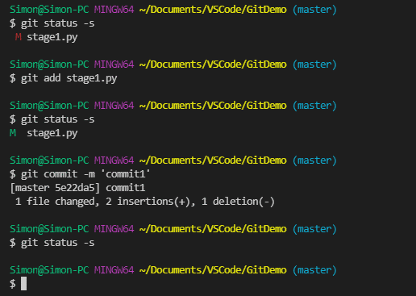

***

### 参数-a：提交缓存区最新修改。

- 一般使用参数-am \<message>。

```git
git commit -am 'message'
```

- 注意：
  1. 提交的是已经缓存的文件。对于工作区中**没有缓存的文件无法直接提交**。Git的提交只是针对缓存区中的文件。
  2. 提交的是工作区中**最新**的修改。即免去 `git add` 的步骤。

>代码说明：红色标识“M”标识工作区有修改但没有缓存。

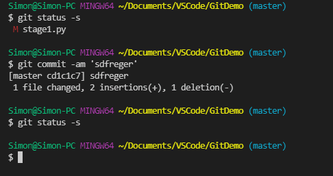

[回到目录](#目录)

***

## 恢复版本：将仓库和缓存区退回到指定HEAD，不保留修心修改git reset

命令

```git
git reset <head>
```

### 参数1\<head>：退回指定HEAD

- 效果
  - 仓库退回到指定HEAD；
  - 指定HEAD之后的提交都不保留；
  - 缓存区与指定HEAD一致。

- 参数形式1：
  - HEAD^ 上一个版本
  - HEAD^^ 上上一个版本
  - HEAD^^^ 上上上一个版本

- 参数形式2：可以使用 `~数字` 表示
  - HEAD~0 表示当前版本
  - HEAD~1 上一个版本
  - HEAD^2 上上一个版本
  - HEAD^3 上上上一个版本
  - 以此类推...

>代码说明：
>1.	查询状态：工作区、缓存区、仓库文件都一致。
>2.	ls-files显示当前缓存区只有demo1_py;
>3.	reset后，恢复此前的demo1.py和demo2_py;
>4.	ls-files显示当前缓存区恢复了demo1.py和demo2_py。
>5.	查询状态：工作区与缓存区不一致。即reset恢复缓存区，保留工作区。

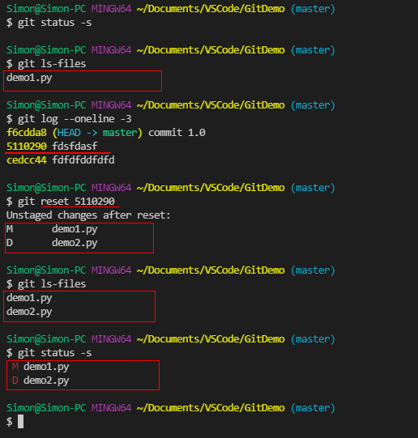

- 注意：恢复后，当前head会变成指定的head。


***

### 参数1 无参数：不会起作用。

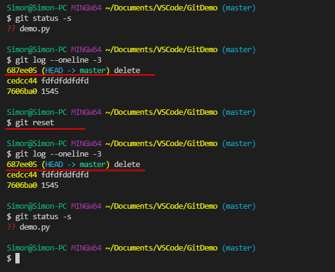

***

### 参数2 mixed：保留修改在工作区(默认)。

当没有参数时，适用--mixed.

>代码说明：
>1.	查询log，显示当前HEAD是modified demo1.
>2.	恢复上一版本到缓存区，并保留当前工作区修改。所以显示unstaged changes.
>3.	查询log，显示当前HEAD是create demo1.
>4.	查询当前状态，显示当前demo1是M，即工作区修改了已缓存的demo1. 证明mixed参数是保留工作区修改，但缓存区是指定版本。

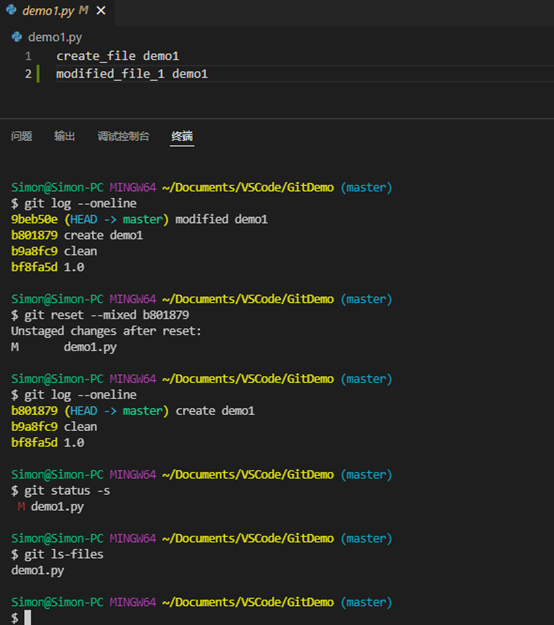

***

### 参数2 soft：保留修改在缓存区

>代码说明：
>1.	查询log，当前HEAD是modified demo1;
>2.	恢复--soft；
>3.	查询log，当前HEAD是create demo1；
>4.	查询状态，显示标识M，表示当前工作区的修改保留在缓存区。相当于工作区与指定版本的修改被 `git add`。

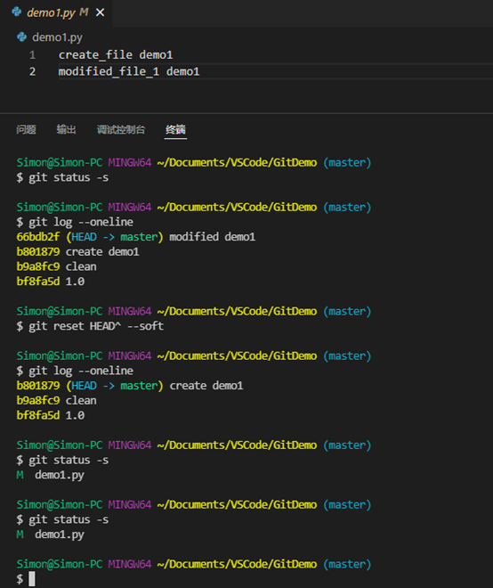

***

### 参数2 hard：不保留修改。工作区与缓存区都被恢复到指定版本。

>代码说明：
>1.	查询log，显示当前HEAD是modified demo；
>2.	恢复版本；
>3.	查询log，显示当前HEAD是create demo;
>4.	查询状态，显示当前工作区，缓存区和指定版本相同。
>所以--hard参数的效果是不保留修改，**工作区与缓存区都被恢复到指定版本**。

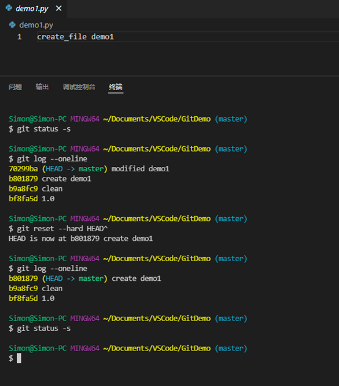

***

### 总结：reset

- --hard：不保留新修改。工作区=缓存区=指定仓库。
- --soft：保留新修改在缓存区。工作区=缓存区 > 指定仓库。
- --mixed/无参数：保留新修改在工作区。工作区 > 缓存区=指定仓库。

[回到目录](#目录)

***

[返回Git首页](../git_index.md)
