# Git - 缓存区操作

[返回Git首页](../git_index.md)

## 目录

- [Git - 缓存区操作](#git---缓存区操作)
  - [目录](#目录)
  - [Cheat Sheet 速查表](#cheat-sheet-速查表)
  - [查看:缓存区中文件 git ls-files](#查看缓存区中文件-git-ls-files)
  - [添加/更新：从工作区添加 git add](#添加更新从工作区添加-git-add)
    - [参数\<filename>:添加/更新指定文件到缓存区](#参数filename添加更新指定文件到缓存区)
    - [参数\<directory>: 添加指定目录到缓存区](#参数directory-添加指定目录到缓存区)
    - [参数.: 添加/更新当前目录下的所有文件到缓存区](#参数-添加更新当前目录下的所有文件到缓存区)
    - [参数\-A: 更新所有变化](#参数-a-更新所有变化)
    - [参数\-u: 更新已缓存文件](#参数-u-更新已缓存文件)
  - [删除：缓存区中的文件 git rm](#删除缓存区中的文件-git-rm)
    - [参数cached: 只删除缓存区中的文件，保留工作区文件](#参数cached-只删除缓存区中的文件保留工作区文件)
    - [参数-f：同时删除缓存区和工作区的文件](#参数-f同时删除缓存区和工作区的文件)
    - [参数-r *：递归当前路径下得所有文件名](#参数-r-递归当前路径下得所有文件名)

***

## Cheat Sheet 速查表

**Git命令：缓存区**

|动作|对象|命令|备注|
|---|---|---|---|
|**查看**|**缓存区**内文件|`git ls-files `||
|**添加**|<指定文件>|`git add <filename>`||
|**添加**|\\指定文件夹\\|`git add directory\`||
|**添加**|当前路径的**所有文件**|`git add .`|**不包含**已删除文件|
|**更新**|**已缓存的文件**|`git add -u|--update`|**不包含**新文件|
|**更新**|**已缓存的文件**|`git add -A`|**包含**已删除文件|
|**删除**|**缓存区**<指定文件>|`git rm --cached \<filename>`||
|**删除**|**工作区**和**缓存区**<指定文件>|`git rm -f <filename>`|**工作区文件**也删除|
|**删除**|**缓存区**当前路径下所有文件|`git rm -r * --cached`|Git: **工作区**当前路径|
|**删除**|**工作区**和**缓存区**当前路径下所有文件|`git rm -r * -f`|Git: **工作区**当前路径|

## 查看:缓存区中文件 git ls-files

命令
```git
git ls-files 
```

- 参数：
  - --cached (-c): 查看暂存区中文件，git ls-files 命令**默认值**
  - --midified (-m): 查看修改的文件
  - --delete (-d): 查看删除过的文件
  - --other (-o): 查看没有被git跟踪的文件
  - --stage (-s): 显示mode以及文件对应的Blob对象，进而我们可以获取暂存区中对应文件里面的内容。

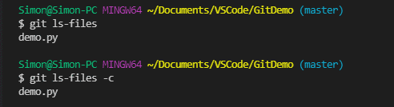

[回到目录](#目录)

***

## 添加/更新：从工作区添加 git add

### 参数\<filename>:添加/更新指定文件到缓存区

命令

```git
git add <filename>
```
在VSC中，工作区中没有提交缓存区的文件会带有**U**标识。当提交到缓存区后，会带有**A**标识。

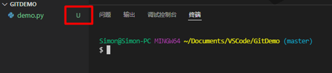

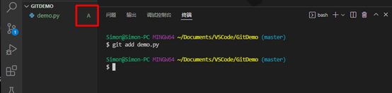

提交缓存区后，可使用`git ls-file`命令查看缓存区的所有文件。


>如果没有指定文件时会显示**did not match any files**

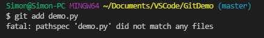

[回到目录](#目录)

***

### 参数\<directory>: 添加指定目录到缓存区

命令

```git
git add \<directory>
```
[回到目录](#目录)

***

### 参数.: 添加/更新当前目录下的所有文件到缓存区

命令

```git
git add .
```

>代码说明：
>1. 查询状态，显示两个文件是"??", 即文件**未缓存**。
>2. 添加当前目录所有文件到缓存；
>3. 查询状态，显示两个文件是"A", 即文件**已缓存**。

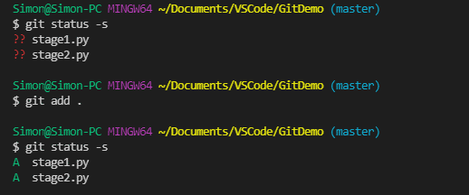

- **注意：包括当前路径中的所有文件夹**

>代码说明：folder是子文件夹. 执行添加后,**子文件夹内文件也一并缓存**。

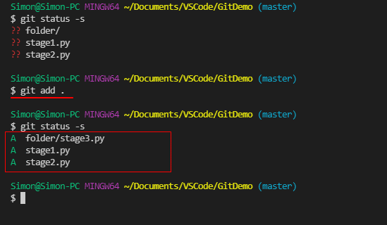

[回到目录](#目录)

***

### 参数\-A: 更新所有变化

命令

```git
git  add -A
```

- 注意：
  - `-A`是大写`A`。否则会返回错误；
  - 包括已经删除的文件；

>代码说明:
>1. 查询状态：
>     - demo1.md: 已缓存，被修改；
>     - demo2.md: 已缓存，被删除；
>     - demo3.md：新建文件；
>2. 执行 `add -A`
>3. 查询状态：
>     - demo1.md: 更新修改；
>     - demo2.md: 删除；
>     - demo3.md：缓存；
> 4. 查看缓存文件：只有demo1，demo3
> 说明：**`-A` 更新所有文件，包括删除文件**

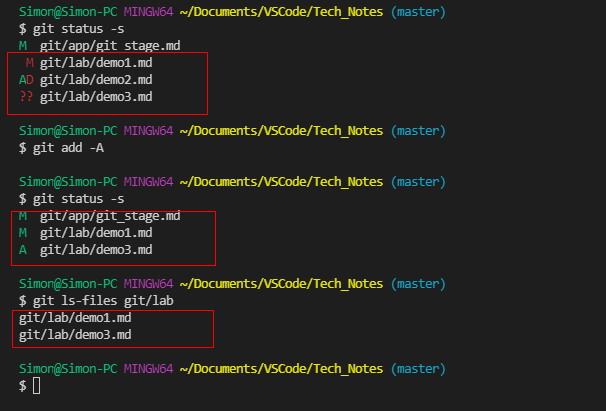

[回到目录](#目录)

***

### 参数\-u: 更新已缓存文件

命令

```git
git  add -u|--update
```

- 参数`-u`或`--update`: 更新已缓存的文件。

>代码说明：
> 1. 查询：
>     - demo1.md: 已缓存，被修改。
>     - demo2.md: 未缓存。
> 2. 执行`add -u`
> 3. 查询：
>     - demo1.md：修改被缓存。
>     - demo2.md: 未缓存。
> 所以`add -u`的效果是：更新**已缓存的文件**。

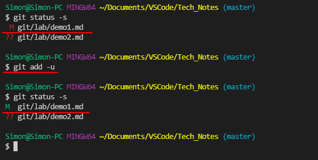

[回到目录](#目录)

***

## 删除：缓存区中的文件 git rm

### 参数cached: 只删除缓存区中的文件，保留工作区文件

命令

```git
git rm --cached <filename>
```

>代码说明：
>1. 查询状态，stage.py状态是**A**，即**已缓存**；
>2. 删除文件;
>3. 查询状态, stage.py状态是??，即**未缓存**；
>所以效果是只**删除缓存区中的文件，保留工作区文件**.

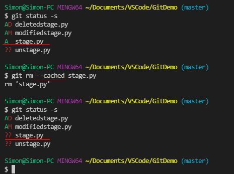

- 缺少指定文件名：显示**No pathspec was given**

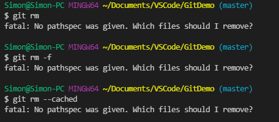

- 文件名不在缓存区：显示**not match any files**

>**注意，只对缓存区作用**


- 无参数：会提示使用参数

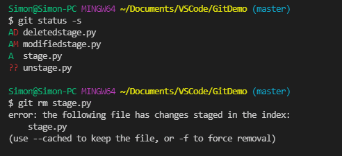


[回到目录](#目录)

***

### 参数-f：同时删除缓存区和工作区的文件

命令

```git
git rm -f <filename>
```

>代码说明：以下的stage.py是在缓存区中，当使用参数-f后悔删除缓存区和工作区的文件。

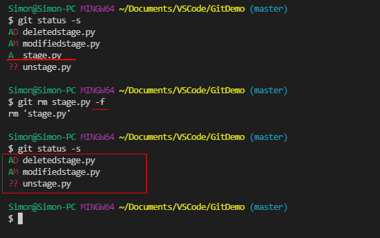

- 注意：是现在缓存区中寻找目标文件，找不到则显示**not match**；找到则删除缓存区文件，并删除工作区文件。

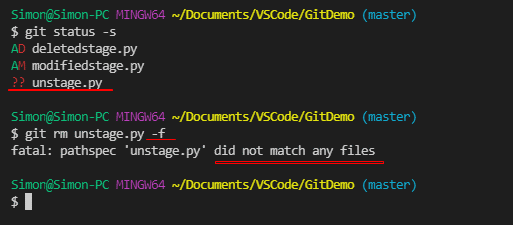

[回到目录](#目录)

***

### 参数-r *：递归当前路径下得所有文件名

命令

```git
git rm -r *
```

>代码说明：
>1. 查看当前状态，返现目前路径工作区中的文件都已经缓存。
>2. 使用-r *，再加强制执行参数-f，将会递归当前路径的文件名并强制删除。
>3. 查看当前状态, 返回为空。即当前路径下的文件在工作区和缓存区被强制删除。

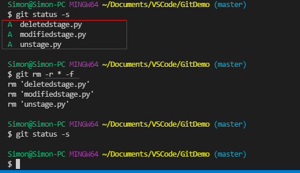

- 注意：递归包括当前路径的**子文件夹**


- 注意：当前路径工作区中文件有没有缓存区的文件时，由于-r *是递归所有文件名，则当递归到没有缓存的文件名时，会不执行删除返回not match.

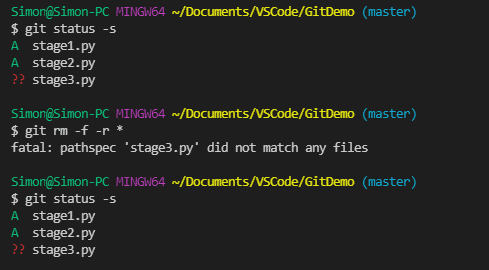

- 注意：当存在AD状态的文件时，即已缓存的文件在工作区删除时，由于工作区递归没有出现AD状态文件名，所以缓存区会保留AD状态的文件。

**即递归的依据是工作区的当前路径。**

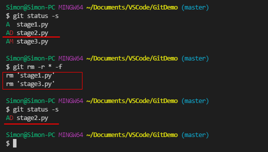

- 注意：对于AM文件，由于存在修改的差异，会被**中止执行**。

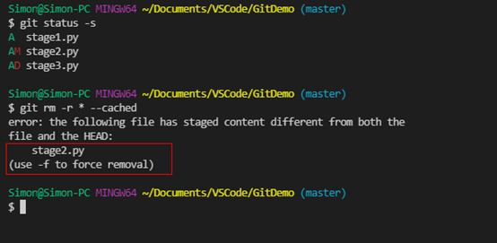

[回到目录](#目录)

***

[返回Git首页](../git_index.md)
