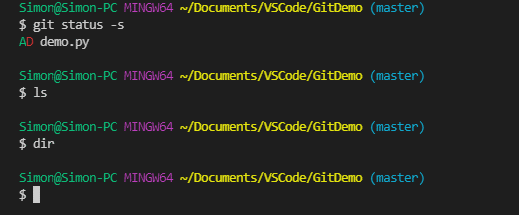
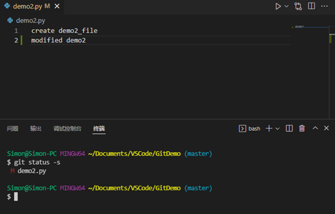

# Git - 工作区操作

[返回Git首页](../git_index.md)

## 目录

  - [添加/删除/更改:使用IDE](#添加删除更改使用ide)
  - [查看:使用命令 ls(powershell)/dir(CMD)](#查看使用命令-lspowershelldircmd)
  - [查看历史:工作区指定文件的修改历史git blame](#查看历史工作区指定文件的修改历史git-blame)
    - [参数\<filename>: 必须指定文件名](#参数filename-必须指定文件名)
  - [恢复:从缓存区复制到工作区 git checkout](#恢复从缓存区复制到工作区-git-checkout)
    - [参数 \<filename>: 恢复指定缓存区指定文件到工作区](#参数-filename恢复指定缓存区指定文件到工作区)
    - [参数-f: 强制恢复缓存区所有文件](#参数-f强制恢复缓存区所有文件) 

***

## 添加/删除/更改:使用IDE

[回到目录](#目录)

***

## 查看:使用命令 ls(powershell)/dir(CMD)

powershell命令
```powershell
ls
```

CMD命令
```powershell
dir
```


- 已缓存文件但在工作区删除的文件，使用命令查看时不会返回文件。



[回到目录](#目录)

***

## 查看历史:工作区指定文件的修改历史git blame

命令
```git
git blame <filename>
```

### 参数\<filename>: 必须指定文件名

>以下代码说明：
>1. 先在工作区修改demo1.py代码
>2. 使用blame查询历史
  


- 注意：查看的是**工作区**的指定文件

>以下代码说明:
>1. 在工作区修改demo1.py代码；
>2. 查询状态，显示是MM，即修改是在工作区；
>3. 使用blame查询历史。


[回到目录](#目录)

***

## 恢复:从缓存区复制到工作区 git checkout

### 参数 \<filename>：恢复指定缓存区指定文件到工作区

命令
```git
git checkout <filename>
```

>以下代码说明
>1. 在工作区修改demo2.py代码；
>2. 查询状态，显示是M，即已缓存并在工作区修改；
>3. 使用checkout，从缓存区恢复；
>4. 查看文件代码，证明demo2.py被恢复。




- 当没有带有指定文件名时，不会起作用。

>以下代码说明
>1. 查询状态，MM;
>2. 缺少文件名恢复checkout;
>3. 查询状态，MM;
>4. 说明：**缺少指定文件时，不起作用**。


- 当指定文件没有修改时，会提示updated 0。

>以下代码说明
>1. 查询状态，MM;
>2. 恢复checkout，**返回updated 0**。


- 注意：是从**缓存区**恢复文件到工作区

> 以下代码说明：
>1.	查询状态，MM表示工作区，缓存，仓库的文件都不相同；
>2.	恢复文件，
>3.	查询状态，M表示已缓存的修改。即checkout指定文件是从缓存区中恢复到工作区。


[回到目录](#目录)

***

### 参数-f：强制恢复缓存区所有文件

命令
```git
git checkout -f
```


> 以下代码说明：
>1.	查询状态，D表示两个文件已经缓存，但在工作区删除；
>2.	强制恢复文件，
>3.	查询状态，返回为空。说明**所有文件已经恢复**。


[回到目录](#目录)

***

[返回Git首页](../git_index.md)
