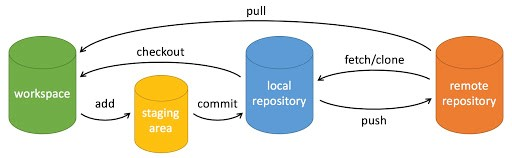

# 技术笔记: Git

[返回Page首页](../index.md)

Git 是一个开源的分布式版本控制系统，用于敏捷高效地处理任何或小或大的项目。

基本关系：

教程地址：  

https://www.runoob.com/git/git-workspace-index-repo.html

***

## 目录
- [Git - 配置文件及层级](./app/git_config_file.md)
  - 系统级别system(优先级最低)
  - 用户级别global(优先级次之)
  - 仓库级别local(优先级最高)
- [Git - 设置配置参数](./app/git_config.md)
  - 查询:所有配置的参数list
    - system:查看系统的所有配置
    - global:查看用户的所有配置
    - local:查看本地的所有配置
  - 查询:特定key的配置值get section.key或section.key
  - 添加:特定key的配置值add
  - 修改：特定key的配置值 section.key value
  - 删除：删除特定键值 unset
  - 编辑器编辑:edit或-e
- [Git - 工作区操作](./app/git_workspace.md)
  - 添加/删除/更改:使用IDE
  - 查看:使用命令 ls(powershell)/dir(CMD)
  - 查看历史:工作区指定文件的修改历史git blame
    - 参数\<filename>: 必须指定文件名
  - 恢复:从缓存区复制到工作区 git checkout
    - 参数\<filename>: 恢复指定缓存区指定文件到工作区
    - 参数-f:强制恢复缓存区所有文件
- [Git - 缓存区操作](./app/git_stage.md)
  - 查看:缓存区中文件 git ls-files
  - 添加/更新：从工作区添加 git add
    - 参数<filename>:添加/更新指定文件到缓存区
    - 参数[dir]: 添加指定目录到缓存区
    - 参数.: 添加/更新当前目录下的所有文件到缓存区
  - 删除：缓存区中的文件 git rm
    - 参数cached: 只删除缓存区中的文件，保留工作区文件
    - 参数-f：同时删除缓存区和工作区的文件
    - 参数-r *：递归当前路径下得所有文件名
- [Git - 本地仓库操作](./app/git_local_repo.md)
  - 创建：本地git仓库 git init
    - 在当前目录创建git仓库
    - 在子目录中创建git仓库
    - 通用命令
  - 克隆：现有的git仓库 git clone
    - 克隆到当前路径
    - 克隆到指定路径
  - 查看变化：上一次提交后的文件变化git status
    - 无参数：显示所有改动的文件
    - 参数-s：简短输出结果
  - 查看历史 git log
    - 无参数：显示详细历史
    - 参数oneline：显示简洁历史
    - 参数graph：以拓扑图显示历史。
    - 参数author：指定用户的历史
  - 提交：将缓存区中的文件提交到仓库git commit
    - 无参数：无参数时，VSC会打开一个文件并在其中编辑
    - 参数-m <message>：提交并输入message信息
    - 参数-a：提交缓存区最新修改
  - 恢复版本：将仓库和缓存区退回到指定HEAD，不保留修心修改git reset
    - 参数1<head>：退回指定HEAD
    - 参数1 无参数：不会起作用
    - 参数2 mixed：保留修改在工作区(默认)
    - 参数2 soft：保留修改在缓存区
    - 参数2 hard：不保留修改。工作区与缓存区都被恢复到指定版本
    - 总结：reset

***

[返回Page首页](../index.md)
