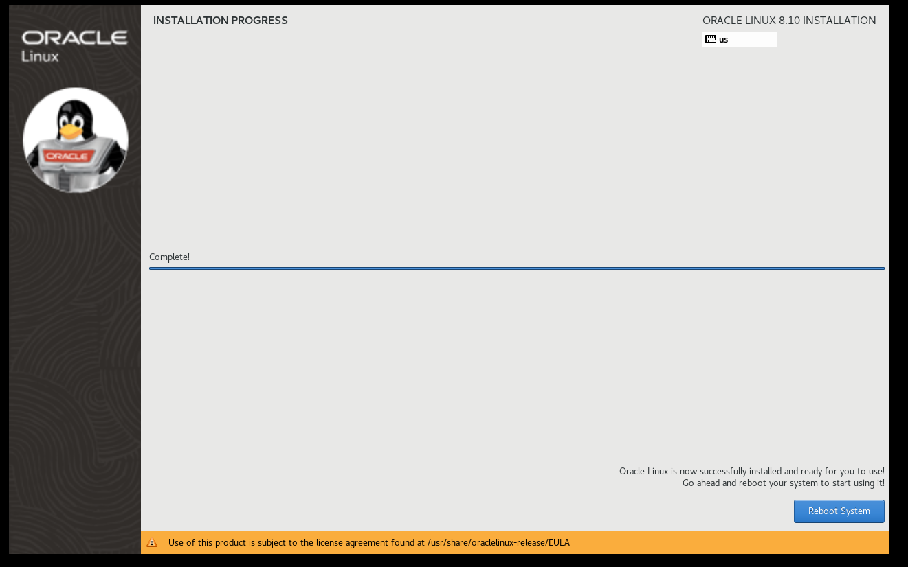

# Configure PXE Server

[Back](../index.md)

- [Configure PXE Server](#configure-pxe-server)
  - [Pre-Configuration](#pre-configuration)
  - [Configure HTTP Server](#configure-http-server)
  - [Configure TFTP Server](#configure-tftp-server)
  - [Configure DHCP Server](#configure-dhcp-server)
  - [Client](#client)
    - [BIOS Method](#bios-method)
    - [EFI Method](#efi-method)
  - [Shell Script](#shell-script)

---

## Pre-Configuration

```sh
# Configure Server Network
nmcli c down ens160
nmcli c modify ens160 ipv4.addresses 192.168.128.10/24
nmcli c modify ens160 ipv4.dns 192.168.128.2
nmcli c modify ens160 ipv4.gateway 192.168.128.2
nmcli c modify ens160 ipv4.method manual
nmcli c modify ens160 connection.autoconnect yes
nmcli c up ens160

hostnamectl set-hostname pxe-server
echo "192.168.128.10 pxe-server" >> /etc/hosts

dnf upgrade -y
```

## Configure HTTP Server

```sh
# Install httpd
dnf install -y httpd

# mount oel8 dvd iso
mkdir -p /var/www/html/oel8
mount -o ro /dev/sr0 /var/www/html/oel8/
# persist mount
echo "/dev/sr0 /var/www/html/oel8 iso9660 defaults 0 0" >> /etc/fstab

# enable and start httpd
systemctl enable --now httpd

# enable http in firewall
firewall-cmd --permanent --add-service=http
firewall-cmd --reload
```

---

## Configure TFTP Server

```sh
# Configure TFTP
dnf install -y tftp-server syslinux
mkdir -pv /var/lib/tftpboot/oel8/pxelinux
cp -rv /var/www/html/oel8/EFI/ /var/lib/tftpboot/oel8
cp -v /var/www/html/oel8/images/pxeboot/{vmlinuz,initrd.img} /var/lib/tftpboot/oel8/pxelinux

# Configure EFI PXE Boot Menu
cat > /var/lib/tftpboot/oel8/EFI/BOOT/grub.cfg <<EOF
set default="1"
set timeout=120

menuentry 'Install Oracle Linux 8.10.0' {
  linux oel8/pxelinux/vmlinuz ip=dhcp inst.repo=http://192.168.128.10/oel8/
  initrd oel8/pxelinux/initrd.img
}
EOF

# Configure BIOS PXE Boot Menu
cp -v /usr/share/syslinux/* /var/lib/tftpboot/oel8/pxelinux
mkdir -v /var/lib/tftpboot/oel8/pxelinux/pxelinux.cfg
cat > /var/lib/tftpboot/oel8/pxelinux/pxelinux.cfg/default <<EOF
default vesamenu.c32
prompt 1
timeout 600

display boot.msg

label linux
  menu label ^Install Oracle Linux 8.10.0
  menu default
  kernel vmlinuz
  append initrd=initrd.img ip=dhcp inst.repo=http://192.168.128.10/oel8/
EOF

# change permission
chmod -R 755 /var/lib/tftpboot/oel8/

# enable and start tftp
systemctl enable --now tftp.socket

# enable tftp in firewall
firewall-cmd --permanent --add-service=tftp
firewall-cmd --reload
```

---

## Configure DHCP Server

```sh

# Configure DHCP
dnf install -y dhcp-server

cat > /etc/dhcp/dhcpd.conf <<EOF
option architecture-type code 93 = unsigned integer 16;

subnet 192.168.128.0 netmask 255.255.255.0 {
  range 192.168.128.50 192.168.128.200;
  option routers 192.168.128.2;
  option domain-name-servers 192.168.128.2, 8.8.8.8, 8.8.4.4;
  option broadcast-address 192.168.128.255;
  default-lease-time 600;
  max-lease-time 86400;

  class "pxeclients" {
    match if substring (option vendor-class-identifier, 0, 9) = "PXEClient";
    next-server 192.168.128.10;
    if option architecture-type = 00:07 {
        filename "oel8/EFI/BOOT/BOOTX64.EFI";
    } else {
        filename "oel8/pxelinux/pxelinux.0";
    }
  }

  class "httpclients" {
    match if substring (option vendor-class-identifier, 0, 10) = "HTTPClient";
    option vendor-class-identifier "HTTPClient";
    filename "http://192.168.128.10/oel8/EFI/BOOT/BOOTX64.EFI";
  }
}
EOF

# enable and start dhcp
systemctl enable --now dhcpd

# enable dhcp in firewall
firewall-cmd --permanent --add-service=dhcp
firewall-cmd --reload
```

---

## Client

### BIOS Method

- Join DHCP network and load bootable


- Load Grub menu


- Load initrd


- Load OEL 8 installer


- Installation




- Reboot


- License


- Login


---

### EFI Method

- Load Bootable


- Load Grub menu


- The rest is the same as BIOS

---

## Shell Script

```sh
#!/bin/bash

# Configuration Parameters
PXE_SERVER_IP="192.168.128.10"
SUBNET_IP="192.168.128.0"
SUBNET_MASK="255.255.255.0"
DHCP_RANGE_START="192.168.128.50"
DHCP_RANGE_END="192.168.128.200"
BROADCAST_IP="192.168.128.255"
GATEWAY_IP="192.168.128.2"
DNS_IP="192.168.128.2"
NET_INTERFACE="ens160"

OS_DVD_PATH="/dev/sr0"
OS_BRIEF="oel8"
OS_VERVOSE="Install Oracle Linux 8.10.0"

# Configure Server Network
nmcli c down $NET_INTERFACE
nmcli c modify $NET_INTERFACE ipv4.addresses $PXE_SERVER_IP/24
nmcli c modify $NET_INTERFACE ipv4.dns $DNS_IP
nmcli c modify $NET_INTERFACE ipv4.gateway $GATEWAY_IP
nmcli c modify $NET_INTERFACE ipv4.method manual
nmcli c modify $NET_INTERFACE connection.autoconnect yes
nmcli c up $NET_INTERFACE

hostnamectl set-hostname pxe-server
echo "$PXE_SERVER_IP pxe-server" >> /etc/hosts

dnf upgrade -y

# Configure HTTP
dnf install -y httpd
mkdir -p /var/www/html/$OS_BRIEF
echo "$OS_DVD_PATH /var/www/html/$OS_BRIEF iso9660 defaults 0 0" >> /etc/fstab
mount -o ro $OS_DVD_PATH /var/www/html/$OS_BRIEF/
systemctl enable --now httpd
firewall-cmd --permanent --add-service=http
firewall-cmd --reload

# Configure TFTP
dnf install -y tftp-server syslinux
mkdir -pv /var/lib/tftpboot/$OS_BRIEF/pxelinux
cp -rv /var/www/html/$OS_BRIEF/EFI/ /var/lib/tftpboot/$OS_BRIEF
cp -v /var/www/html/$OS_BRIEF/images/pxeboot/{vmlinuz,initrd.img} /var/lib/tftpboot/$OS_BRIEF/pxelinux

# Configure EFI PXE Boot Menu
cat > /var/lib/tftpboot/$OS_BRIEF/EFI/BOOT/grub.cfg <<EOF
set default="1"
set timeout=120

menuentry '$OS_VERVOSE' {
  linux $OS_BRIEF/pxelinux/vmlinuz ip=dhcp inst.repo=http://$PXE_SERVER_IP/$OS_BRIEF/
  initrd $OS_BRIEF/pxelinux/initrd.img
}
EOF

# Configure BIOS PXE Boot Menu
cp -v /usr/share/syslinux/* /var/lib/tftpboot/$OS_BRIEF/pxelinux
mkdir -v /var/lib/tftpboot/$OS_BRIEF/pxelinux/pxelinux.cfg
cat > /var/lib/tftpboot/$OS_BRIEF/pxelinux/pxelinux.cfg/default <<EOF
default vesamenu.c32
prompt 1
timeout 600

display boot.msg

label linux
  menu label ^$OS_VERVOSE
  menu default
  kernel vmlinuz
  append initrd=initrd.img ip=dhcp inst.repo=http://$PXE_SERVER_IP/$OS_BRIEF/
EOF

chmod -R 755 /var/lib/tftpboot/$OS_BRIEF/
systemctl enable --now tftp.socket
firewall-cmd --permanent --add-service=tftp
firewall-cmd --reload

# Configure DHCP

dnf install -y dhcp-server
cat > /etc/dhcp/dhcpd.conf <<EOF
option architecture-type code 93 = unsigned integer 16;

subnet $SUBNET_IP netmask $SUBNET_MASK {
  range $DHCP_RANGE_START $DHCP_RANGE_END;
  option routers $GATEWAY_IP;
  option domain-name-servers $DNS_IP, 8.8.8.8, 8.8.4.4;
  option broadcast-address $BROADCAST_IP;
  default-lease-time 600;
  max-lease-time 86400;

  class "pxeclients" {
    match if substring (option vendor-class-identifier, 0, 9) = "PXEClient";
    next-server $PXE_SERVER_IP;
    if option architecture-type = 00:07 {
        filename "$OS_BRIEF/EFI/BOOT/BOOTX64.EFI";
    } else {
        filename "$OS_BRIEF/pxelinux/pxelinux.0";
    }
  }

  class "httpclients" {
    match if substring (option vendor-class-identifier, 0, 10) = "HTTPClient";
    option vendor-class-identifier "HTTPClient";
    filename "http://$PXE_SERVER_IP/$OS_BRIEF/EFI/BOOT/BOOTX64.EFI";
  }
}
EOF

systemctl enable --now dhcpd
firewall-cmd --permanent --add-service=dhcp
firewall-cmd --reload
```
