# MySQL - 安装（Windows 8）

[返回MySQL首页](../mysql_index.md)

## 目录

  - [官网下载](#官网下载)
  - [安装设置](#安装设置)
  - [设置windows系统变量](#设置windows系统变量)
  - [验证](#验证)
  
***

## 官网下载

官网下载地址：https://www.mysql.com/downloads/

1. 点击首页最底链接

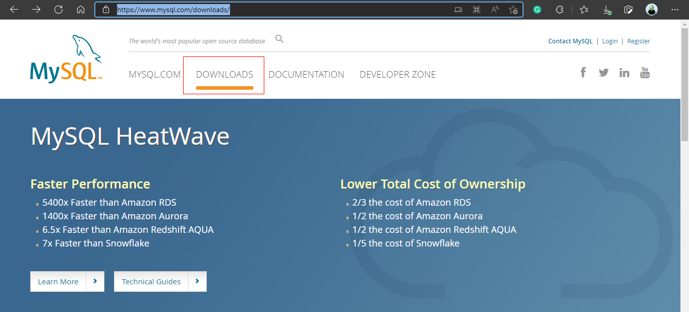

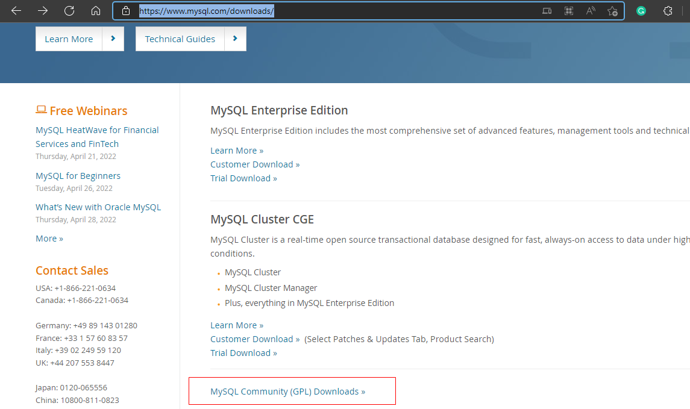

2. 点击Installer for Windows

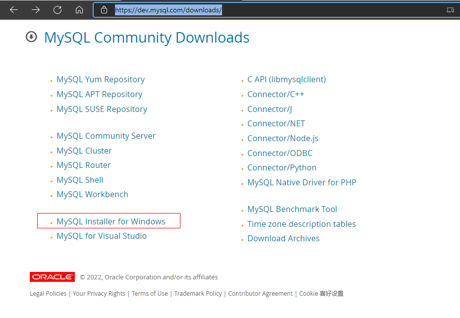

3. 选择较大的安装文件；选择无登入下载。

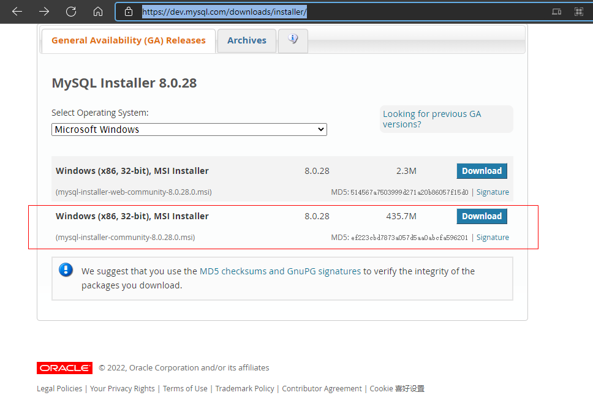

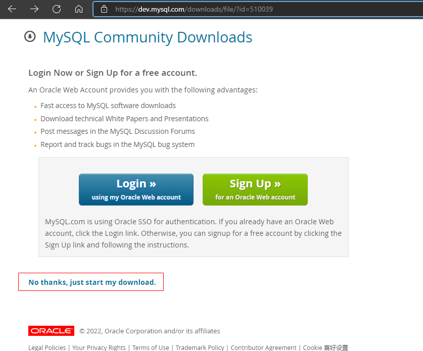

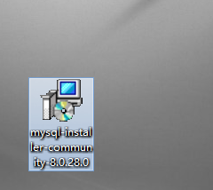

[回到目录](#目录)

***  

## 安装设置

1. 自定义安装;
2. 安装组件MySQL Server;
3. 网络设置：默认端口是3306;

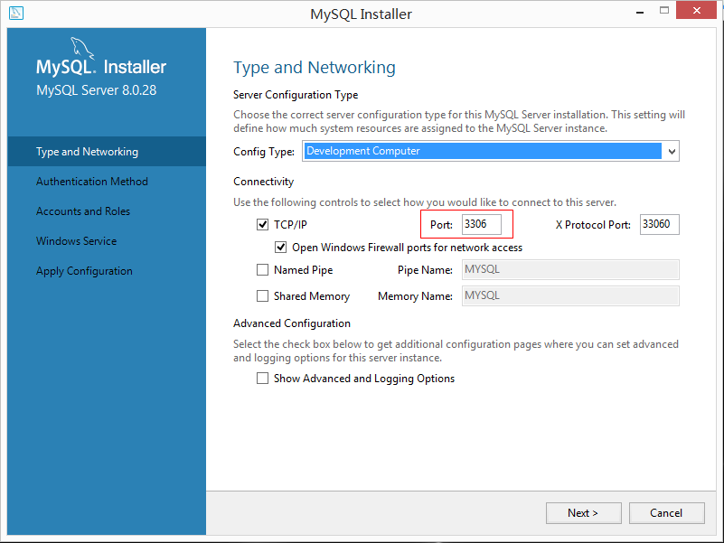

4. 用户名和密码;

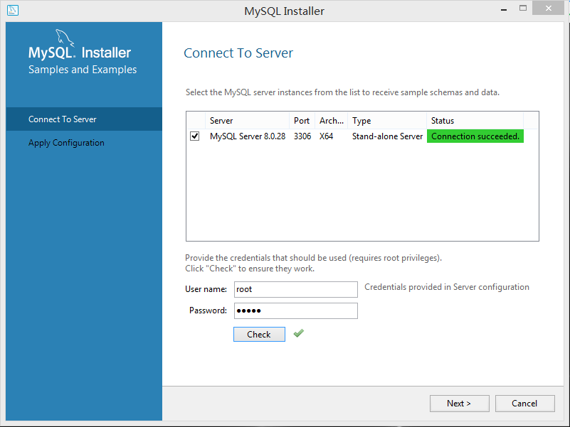

[回到目录](#目录)

***

## 设置windows系统变量

- 安装MySQL后，使用windows CMD无法调用MySQL.
  
- 需要在windows系统变量中添加MySQL配置.

1. 复制路径: `\<安装路径>\MySQL\MySQL Server 8.0\bin`

2. 控制面板 >> 系统 >> 高级系统设置 >> 高级 >> 环境变量

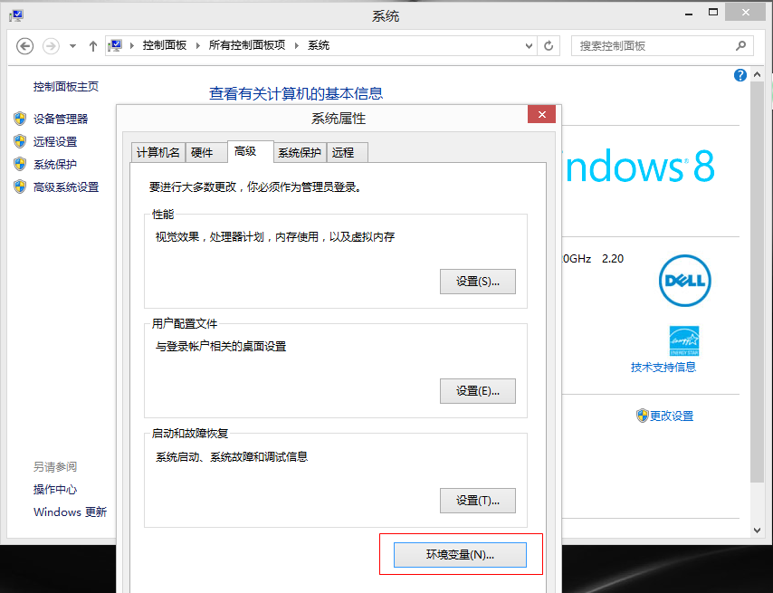

3. 在系统变量中选中Path，点击编辑，在对话框中粘贴MySQL路径，使用分号与其他变量分隔。

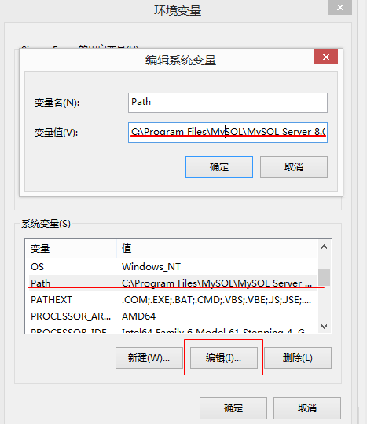

>原理说明：
该路径中有应用程序`MySQL.exe`，所有当该路径添加到系统变量时，即可以调用该程序。

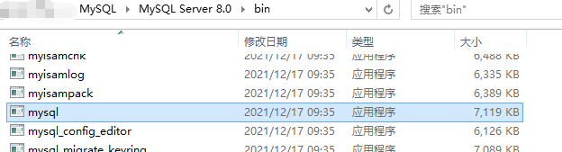

[回到目录](#目录)

***

## 验证

1. 运行CMD;
2. 输入命令 `mysql -u <user> -p <pwd>`
3. 如果进入mysql系统，则证明安装成功。

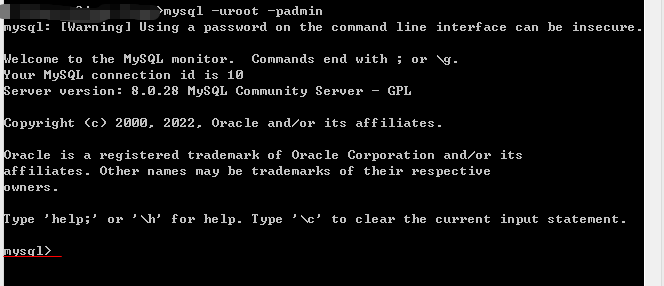

[回到目录](#目录)

***
[返回mysql首页](../mysql_index.md)
