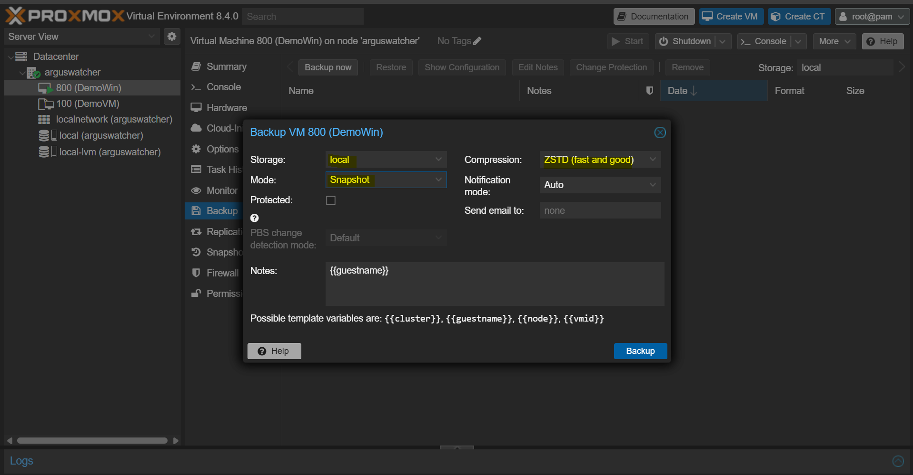

# 

[Back](../proxmox.md)

---

## Backup vs Snapshot

- `Backup`
  - A copy of an instance, which can be a VM or a container, that is separated from the instance.
  - Can be cloned and move around.
- `snapshot`
  - a copy of an instance that is become part of the target.
  - Can not be cloned or move around.

---

## Snapshot

- GUI

---

## Backup and Restore

- **Mode**: Affect downtime, can be a trade-off
  - **Stop**: Poweroff instance. When backup finish, instance will be started again if the instance was running.
  - **Suspend**: suspend the instance for a while.
  - **Snapshot**: might create data consistency problem. Installation of qume package can help.

- Restore
  - Require to shutdown the instance

---

## Backup Job: Data Center level

- Best Practices
  - Store the backup with a shared storage.
  - Can be done using Proxmox Backup