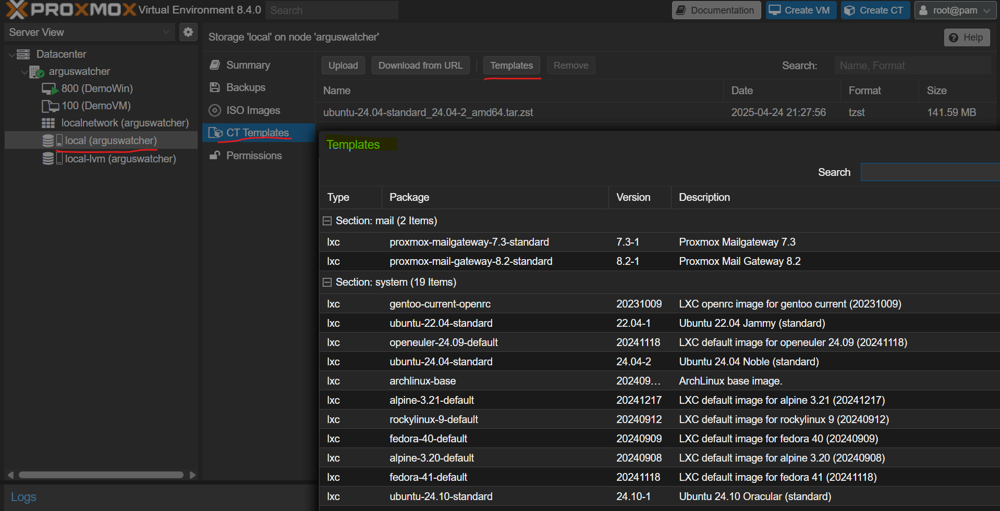

# Proxmox - Container

[Back](../proxmox.md)

- [Proxmox - Container](#proxmox---container)
  - [LXC](#lxc)
  - [Download Container Template](#download-container-template)
  - [Create LXC](#create-lxc)
  - [Start a Container](#start-a-container)
    - [Configure SSH Connection](#configure-ssh-connection)
    - [Seting up a Web Server](#seting-up-a-web-server)
  - [Create LXC Template](#create-lxc-template)
    - [Create a new container from a template](#create-a-new-container-from-a-template)

---

## LXC

- `Linux Containers(LXC)`

  - a virtualization technology that allows to create and run multiple isolated Linux environments on a single host system.
  - Automatically save the state.

- `Proxmox VE` uses `Linux Containers (LXC)` as its underlying container technology.

---

## Download Container Template



---

## Create LXC


---

## Start a Container


---

### Configure SSH Connection

- Update NAT

```sh
# on proxmox host
# Inbound rule port forwarding
iptables -t nat -A PREROUTING -i wlp7s0 -p tcp --dport 2222 -j DNAT --to-destination 192.168.100.20:22

# outbound rule
iptables -A FORWARD -p tcp -d 192.168.100.20 --dport 22 -j ACCEPT

# confirm
iptables -t nat -L -v -n | grep 192.168.100.20

netfilter-persistent save
```

- Create user in Container

```sh
# on Container
adduser conuser

# add user to sudo

usermod conuser -aG sudo
```

- Login on Control machine (Laptop)

```sh
ssh -p 2222 conuser@192.168.1.80
```

---

### Seting up a Web Server

- install apache

```sh
apt update
apt install -y apache2
```

- Update NAT

```sh
# on proxmox host
# Inbound rule port forwarding
iptables -t nat -A PREROUTING -i wlp7s0 -p tcp --dport 2080 -j DNAT --to-destination 192.168.100.20:80

iptables -t nat -L -v -n | grep 192.168.100.20
# 1    52 DNAT       6    --  wlp7s0 *       0.0.0.0/0            0.0.0.0/0            tcp dpt:2080 to:192.168.100.20:80
```

- Test
  - http://192.168.1.80:2080/


---

## Create LXC Template

- Prepare template container

```sh
# ssh on template container
# update pacakges
sudo apt update && sudo apt upgrade -y

# clean outdate packages
sudo apt clean
# remove orphan packages
sudo apt autoremove

# remove ssh host key
sudo rm /etc/ssh/ssh_host_*

# remove the machine id
sudo truncate -s 0 /etc/machine-id

sudo poweroff
```

- Create template


- Symbol gets changed


---

### Create a new container from a template


- Configure the container for ssh

```sh
# on new clone container, reconfigure ssh host
dpkg-reconfigure openssh-server
```