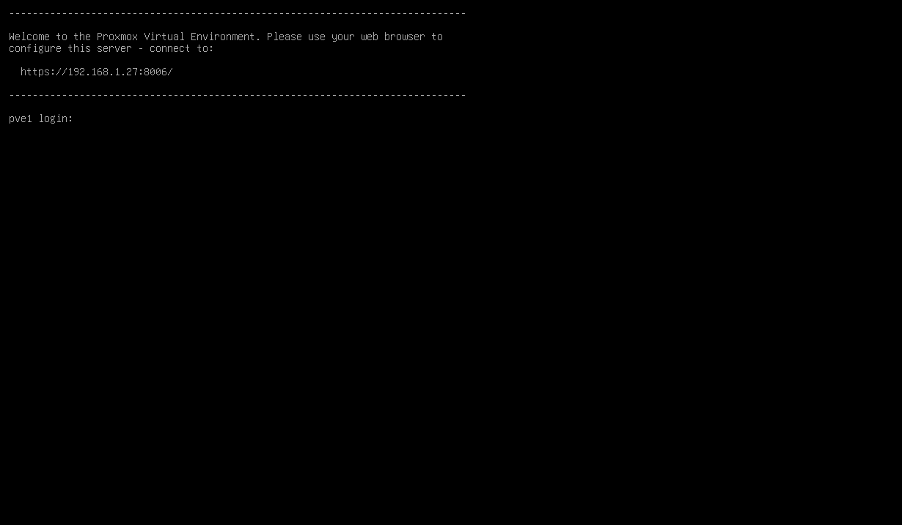

# Proxmox - Installation

[Back](../proxmox.md)

- [Proxmox - Installation](#proxmox---installation)
  - [Prerequisite](#prerequisite)
  - [Installation](#installation)
    - [Troubleshooting: Failed with Exit Code 1 at Line 1023](#troubleshooting-failed-with-exit-code-1-at-line-1023)
  - [Configure Physical Interface with Wi-fi](#configure-physical-interface-with-wi-fi)
    - [Step1: Install `nmcli` Package Offline](#step1-install-nmcli-package-offline)
    - [Step2: Configure Wi-fi Connection](#step2-configure-wi-fi-connection)
  - [Bridge Physical Interface with Virtual Network Interface](#bridge-physical-interface-with-virtual-network-interface)
    - [Step 1: Configure Interfaces](#step-1-configure-interfaces)
    - [Step 2: Configure NAT](#step-2-configure-nat)

---

## Prerequisite

- Download `Proxmox` ISO: [Proxmox VE ISO](https://www.proxmox.com/en/downloads/proxmox-virtual-environment/iso)
- Create Bootable USB: Use [Balena Etcher](https://etcher.balena.io/)

---

## Installation

- Boot from USB
  - Insert the bootable USB and start the machine.


- Set Root Password:


- Configure network




- Access Web GUI:
  - Open a browser and navigate to `http://<host_ip>:8006`.


---

### Troubleshooting: Failed with Exit Code 1 at Line 1023

- **Error**:
  - `command 'unsquashfs -f -dest /target -i /cdrom/pve-base.squashfs' failed with exit code 1 at /usr/share/perl5/Proxmox/Install.pm line 1023`.


- **Cause**: Incompatible media (e.g., SD card).
- **Solution**: Use a USB flash drive.

---

## Configure Physical Interface with Wi-fi

- **Issue**:
  - `Proxmox` defaults to **Ethernet**.
  - The **physical interface** with **Wi-Fi** requires additional configuration as `nmcli` is not installed by default.

---

### Step1: Install `nmcli` Package Offline

- 1. Set up a `Proxmox` VM with network access.
- 2. Update index and capture the reuiqed dependencies

```sh
# On a VM that installs Proxmox
apt update

apt install Network-Manager
# press no, to stop installation
# return the packages required for Network-Manager
```


- 3. Download packages and dependencies.

```sh
# on vm
# download package and dependencies
apt-get download network-manager dns-root-data dnsmasq-base libbluetooth3 libduktape207 \
libgudev-1.0-0 libjim0.81 libmbim-glib4 libmbim-proxy libmbim-utils libmm-glib0 libndp0 \
libnl-genl-3-200 libnm0 libpcsclite1 libpolkit-agent-1-0 libpolkit-gobject-1-0 \
libqmi-glib5 libqmi-proxy libqmi-utils libqrtr-glib0 libteamdctl0 modemmanager \
polkitd ppp usb-modeswitch usb-modeswitch-data wireless-regdb wpasupplicant xml-core
```

- 4. Test offline installation on VM

```sh
# on vm
dpkg -i *.deb
nmcli -v  # Should return version if success
```

- 5. Compress and transfer to the target machine using USB

```sh
# on vm
tar czvf ~/nmcli_pkgs.tar.gz *.deb
```

- Target machine: Install package and dependencies

```sh
# on target machine
dpkg -i *.deb
nmcli -v  # Verify version
```

---

### Step2: Configure Wi-fi Connection

- 1. Check Wi-Fi status:

```sh
# On target machine
nmcli radio wifi
# enabled

# In the case that wifi is disabled
nmcli radio wifi on

# In the case that the wifi interface is unmanaged.
# list interfaces
nmcli d

# Change the nmcli cf
nano /etc/NetworkManager/NetworkManager.conf
# change:
[ifupdown]
managed=true

# restart nmcli
systemctl restart NetworkManager
# confirm
nmcli device

```

- 2. List and connect to Wi-Fi:

```sh
# List available Wi-Fi networks
nmcli d wifi list
# Connect to Wi-Fi
nmcli dev wifi connect "wifi_name" password "password"
# Set connection to autoconnect
nmcli connection modify "wifi_name" connection.autoconnect yes

# Verify connectivity:
ip a
ping -c 3 8.8.8.8
```

- Now the physical interface can connect with the Wi-fi
  - The `Proxmox` host is able to access Internet with physical interface.

---

## Bridge Physical Interface with Virtual Network Interface

- **Architecture**


- Due to the Wi-fi connection, the **Virtual Network Interface** cannot bridge directly with the **Physical Network Interface** to enable VMs and containers in the `Proxmox` virtual network to access external network or the Internet.
- 2 Interface

  - **Physical Network Interface**: the interface on the `Proxmox` host machine that enables connection with Wi-fi network.
  - **Virtual Network Interface**: the interface used by `Proxmox` control VMs and containers.

- **Issue**:
  - VMs and containers in the Proxmox virtual LAN cannot access Internet.
  - By default, Debian system use `ifupdown` package, a low level package to manage the network. However, due to the use of Wi-fi, the `Network-Manager`, a high level pacakge, is install, creating protential configuration conflict.
- **Solution**:
  - Using NAT to bridge 2 interface
  - Only use `nmcli` for the Wi-fi connection. Use the `networking` service to manage the network interface configuration.

---

### Step 1: Configure Interfaces

- Configure interfaces with 2 subnet

  - wifi interface:
    - auto enable
    - using static mode
    - setup ip, subnet, gateway, and dns based on the wi-fi network
  - `vmbr0`, the default `Proxmox` Linux interface
    - auto enable
    - using manual mode for bridge
    - setup ip, subnet, gateway
    - bridge:
      - none: not actively forwarding traffic, due to the wifi connection.
      - stp off: no longer participate in the STP process.
      - fd 0: forwarding delay is 0.

- 1. Backup interface cf

```sh
# backup
cp /etc/network/interfaces /etc/network/interfaces.bak

cat > /etc/network/interfaces <<EOF
# Loopback
auto lo
iface lo inet loopback

# ethernet interface
iface enp6s0 inet manual

# Wi-Fi interface - used only for host
auto wlp7s0
iface wlp7s0 inet static
        address 192.168.1.80
        netmask 255.255.255.0
        gateway 192.168.1.1
        dns-nameservers 192.168.1.1 8.8.8.8

# Proxmox host IP on LAN
auto vmbr0
iface vmbr0 inet manual
        address 192.168.100.0/24
        bridge-ports none
        bridge-stp off
        bridge-fd 0
EOF
```

- 2. Apply cf to wifi interface

```sh
# apply to interfaces
ifdown wlp7s0 && ifup wlp7s0
ifdown vmbr0 && ifup vmbr0

# confirm
ping -c3 192.168.1.1
ping -c3 8.8.8.8
ping -c3 google.com
```

- Test GUI access on the new ip
  - `http://new_ip:8006`

---

### Step 2: Configure NAT

- 1. Enable forwarding

```sh
# Enable forwarding
nano /etc/sysctl.conf
# net.ipv4.ip_forward=1

# Apply immediately:
sysctl -p
```

- 2. Configure NAT
  - Allow vLan access via wifi interface
  - Allow

```sh
# clear all NAT rules
iptables -t nat -F
# clear all forwarding rules
iptables -F FORWARD

# Create NAT rule
# allowing devices on the vLAN to access the internet through physical interface.
iptables -t nat -A POSTROUTING -s 192.168.100.0/24 -o wlp7s0 -j MASQUERADE
# Outbound rule
# allow devices on the vLAN to send traffic to the internet via physical interface.
iptables -A FORWARD -s 192.168.100.0/24 -o wlp7s0 -j ACCEPT
# Inboud rule
# Allow return traffic from the internet to reach devices on the vLAN.
iptables -A FORWARD -d 192.168.100.0/24 -m state --state ESTABLISHED,RELATED -i wlp7s0 -j ACCEPT

# confirm
iptables -t nat -L -v -n

# persis the NAT
netfilter-persistent save
```

- Test on a VM within the vLan

```sh
ping -c3 192.168.1.1
ping -c3 8.8.8.8
ping -c3 google.com

apt update
```

---
